## What is an entity?

Entities are the components of a scene, so a scene is basically a group of entities.

There are different kinds of entities in Goo Create. If you open the 'create entity' panel in the top center of the interface, an overview will show up with all the different entities.

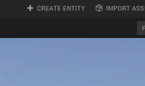

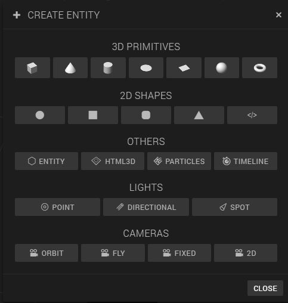

## Adding a cylinder to the scene

 For the posts that will support the house, we're going to use the 3D cylinder entity

 1. Click on the cylinder in the 'Create Entity' pop-up screen
 

 2. Rename the entity to 'Moon station part' by unfolding the first item in the inspector panel on the left. You can unfold an item by clicking on it.
  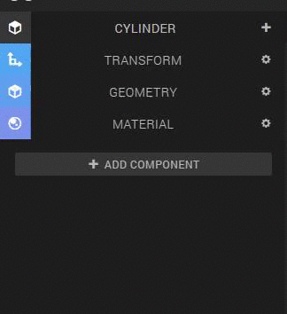

## Change the 'translation' and 'rotation' values of the cylinder entity

Now we have added and renamed the entity, but it doesn't really looks like a part of our Moon station yet. We have to change the dimensions of the entity, and rotate the entity so it stands straight.

**Hint**: If you click on an entity in the scene or in the hierarchy panel and press 'S', the camera will focus on that entity

1. Unfold the 'Transform' item, which is also in the inspector panel. Try it out!
  

2. Play around with the values to see what happens when you change them. As you probably noticed:
    * The first row of values is for changing the position of the entity. This is called **translation**.
    * The second row of values is for rotating the entity. This is called... * drums * ... **rotation**.
    * The last row of values is for changing the dimension of the entity. This is called **scale**.
    * The **X, Y and Z** on top represent the coordinates.

3. Adjust the transform values of the entity to the following values to create your first Moon station part
  

    You probably have to zoom out a bit to see the result of the transformation

    As you can see, the Moon station part is half under the grid We can bring the entity upwards by dragging the arrow that is pointing up upwards, like this:
    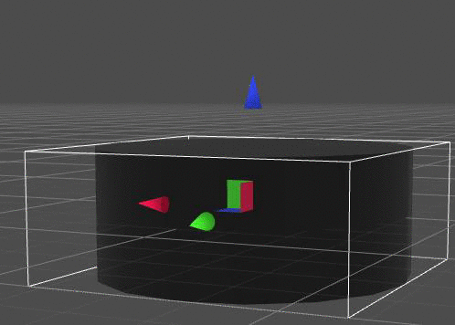

## Duplicate the Moon station part

In the result scene of this part, you probably noticed that there are multiple Moon station parts that are connected by tunnels. First, we are going to clone the 'Moon station part' entity a couple of times and change the position of the cloned entities.

  1. Create a folder in the hierarchy by clicking on 'Entity' in the 'Create Entity' panel. Rename the entity to 'Moon station' to keep the hierarchy clear since we are going to add more Moon station parts.
  
  2. Drag the 'Moon station part' entity into the 'Moon station' entity
  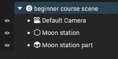
  3. Select the 'Moon station part' entity inside of the 'Moon station' entity and press on the 'copy' button on top of the hierarchy panel
  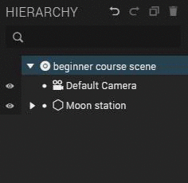
      You can't see the cloned Moon station part because it's inside the other Moon station part.
  4. Drag the second Moon station part to the correct position
  
  5. Repeat step 3 and 4 until you have something like this:
  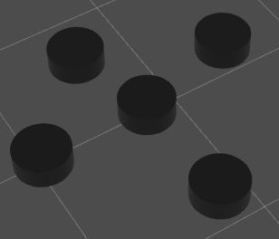
  6. We have to make one 'Moon station part' bigger, the one where we put the satallite on top. Choose an entity where you want to put the satallite on, select the entity in the hierarchy or by clicking on it in the canvas, and change the X and Y *scale* values from 15 to 30.
  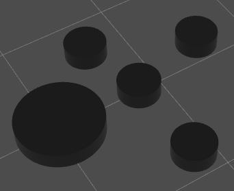

## Create the tunnels between the Moon station parts

For the tunnels, we're also going to use cylinder entities.

1. Click on the cylinder in the 'Create Entity' pop-up screen

2. It could be that you can't see it because it's inside another entity. In that case, drag it until it's visible
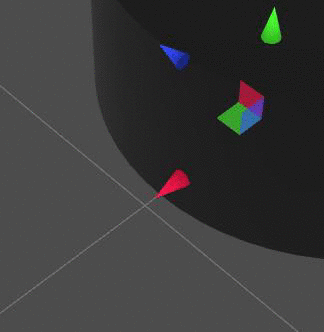
3. Open the transform item in the inspector panel of the just-added cylinder, and change the scale to X: 4, Y: 8 and Z: 25.

4. Drag the tunnel in the good position. The tunnels should be half under the grid, because then they look like tunnels instead of cylinders when we add the Moon surface
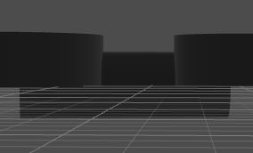
How it is going to look like when we add the Moon surface:
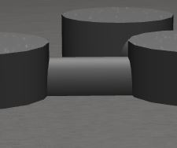
   **Hint:** You can rotate instead of change the position of an entity by clicking the rotate icon on the top right side of the canvas.
 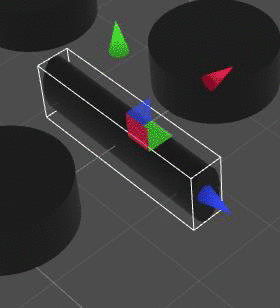
5. Rename the cylinder to 'Tunnel' and drag it in the 'Moon station' folder

6. Copy the 'Tunnel' entity and repeat step 4
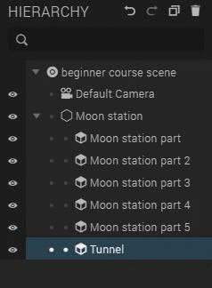
7. Repeat step 6 until all your Moon station parts are connected with tunnels. At the end it should look like this:
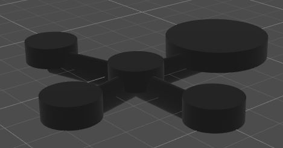
