# The Moon surface

The first entity we're going to add a material to is the Moon surface. We have to import the material first before we can add it to the Moon surface. You can find the material in the *Asset Library*, in addition to many other things like skyboxes, 3D models and readymade scripts.

## Import the material asset from the Asset Library

1. Click on the *Import Asset* button, which you can find next to the *Add Entity* button at the center top of the canvas

2. We are going to use the 'concrete' material for the Moon surface, because it looks like Moon soil. Search for 'concrete' on the top right corner of the asset library

4.  The Concrete Material should now appear. Add it to your scene by double-clicking the asset.

The material is now added to the Asset bin
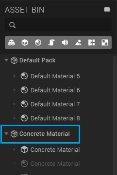

## Add the material to the Moon surface

1. Select the Moon surface in the hierarchy panel
2. Expand the *Material* component in the inspector panel

3. Drag and drop the *Concrete material* from the *asset bin* to the *material box*.
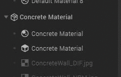

**Hint:** You can recognize materials on the following icon:

The material looks very blurry and stretched right now because the Moon surface is so big, so we have to change the *repeat* settings of the texture:

1. Unfold *Color (Diffuse)* and click on the texture to open the texture settings

2. Unfold the *Placement* item and change *Repeat U* to '200' and *Repeat V* to 130.

We also have to increase the *Normal Map Strength* of the material

3. Go back to the *Material* settings by clicking on the entity name, in our case 'Moon Surface', at the top above the texture name

4. Unfold the *Normal* item and increase the *strength* value to '10'. The slider is locked to '2' for more precision between 0 and 2, so you have to type it in manually.
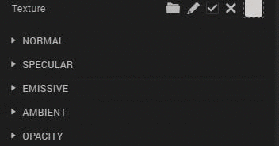

Look's much better, don't you think?

Optionally, you could change the color of the Moon surface. You can make it darker or lighter, or even a whole different color (though then it doesn't really looks like the surface of the Moon anymore).

To change the color:

1. Unfold the *Color (Diffuse)* item again
2. Click on the color and change the color to the color that you want

You can do this for the Moon station as well!

1. Select a 'Moon station part' or a 'Tunnel' entity in the 'Moon station' entity in the hierarchy panel
2. Expand the *Material* component in the inspector panel

3. Unfold the *Color (Diffuse)* item again
4. Click on the color and change the color to the color that you want

I've changed the colors of my Moon station to black and white:
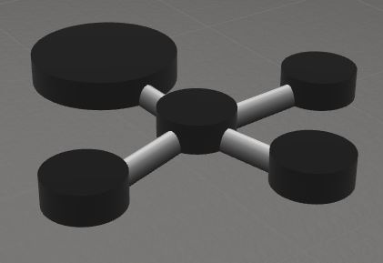

# Add a texture to the Earth

For the Earth we are going to use an image of a flat version of the Earth and wrap it around our 'Earth' sphere entity.

1. <a href="/courses/beginner/4/earth.jpg" download="earthtexture">Click here to download the image</a>
2. Select the Earth in the Hierarchy panel or by clicking on  the Earth on the canvas
3. Unfold the *Material Component* and inside the *Material Component* the *Color (Diffuse)* item

4. Drag and drop the earth image in the texture box
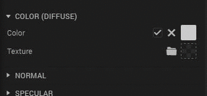

If you look closely, you can see that the image of the Earth is now wrapped around our sphere, but it's very hard to see because there doesn't shine any light on the Earth Sphere. You can fix this by following the steps below.

1. In the *Material component* of the Earth entity, unfold *Ambient*
2. Change the *Ambient color* to white.
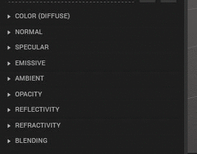

Finally, give the following rotation values to the earth in the *Transform component*:

Your scene should now look like this:
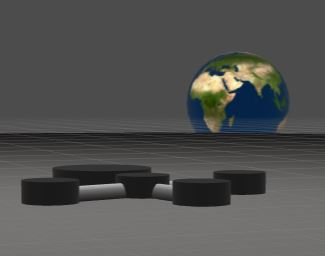

# The Starry sky

To can add a sky to our scene by creating a skybox.

1. <a href="/courses/beginner/4/starpattern.jpg" download="starpattern">Click here to download the star pattern image</a>
2. Select the name of your project in the *Hierarchy panel*
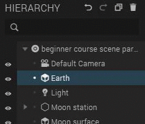
3. Unfold *Environment* in the *Inspector Panel*
4. Unfold *Skybox*
5. Click on the **+** to create a new skybox
6. Click on the pencil icon to edit the skybox
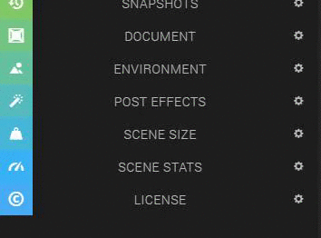
7. Unfold *Textures*
8. Make sure the *shape* is set to 'box'.
9. Drag and drop the star pattern image that you've downloaded in step 1 in all the sides of the box
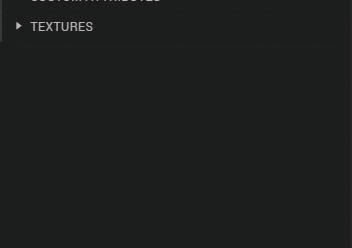
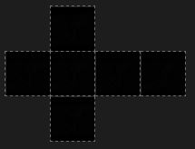

Looks good, but the horizon of the Moon doesn't really fades away in the sky. To accomplish this, we have to set the ambient color of the Moon surface entity to black.

1. Select the *Moon surface* entity in the *Hierarchy panel*
2. Unfold the *Material component* in the *Inspector panel*
3. Unfold *Ambient*
4. Set the *Ambient color* to black
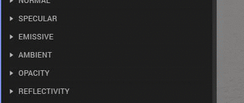

Your scene should now look like this:
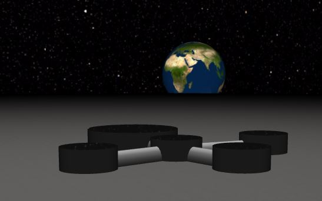
