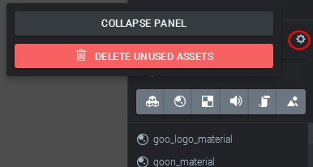
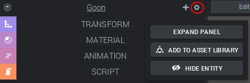

The Asset Panel collects all shareable assets in the scene. It has a search box and filter buttons to sort through the assets easily.  

### Duplicating Assets

All assets in the panel can be duplicated by clicking the corresponding icon. This creates an independent copy of the asset which can be edited individually.  

Duplicate an asset  

### Removing Unused Assets

Having too many assets will affect performance negatively, since bandwidth and loading times are very important for web applications. There is a useful function which deletes all currently unused assets in the scene, but use this with caution as it is **not reversible**! You are strongly recommended to take a _snapshot_ of your project before doing this. The button is accessible by first clicking the gearbox icon at the top of the panel.  

Showing the button to remove all assets  

## The Asset Library

Configured assets can be added to the Asset Library for re-use later. That means that if you have a perfect material you'd like to store, or the most amazing entity mankind has ever seen, you can very easily add it straight from the Asset Library later. The library is accessed by clicking the Import button at the top of the interface.  

Access the Asset Library  

The Asset Library has a list of different sources and collections, including your own added assets. Assets can be added to the library by clicking the _Add To Asset Library_ button (easy, eh?) next to the asset in the various panels, or with the icon in the Asset Panel.  

Add an asset to the library  

Whole entities can also be added to the library, of course! The option for adding is accessed by first opening the _Entity Options_ by clicking the gearbox icon at the top of the _Entity Inspector_.  

Adding an entity to the asset library