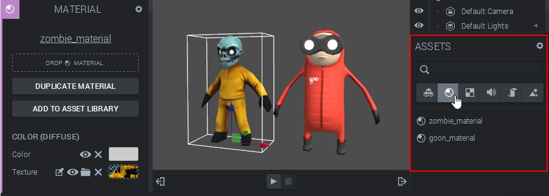

A renderable 3D entity must have a mesh and a material ([Material](http://code.gooengine.com/latest/docs/Material.html) class in the engine). A material defines the look of the entity, and is composed by a large collection of various settings. Some settings have color and texture channels, while others are represented by a value or multiple options. Each material has basic settings like diffuse and specular color, as well as advanced settings such as refraction and blending modes.  

  

The Material Panel  

Materials can be shared between entities. If a material is shared, changing the look of one entity will also change the ones which are sharing the material! All materials are viewable from the right-hand **Asset Panel**. From there, materials can be dragged onto the dotted _Drop Material_ area at the top of the Material Panel.  

  

The Asset Panel, filtered to show only materials.  