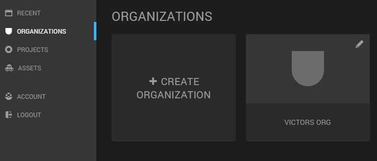
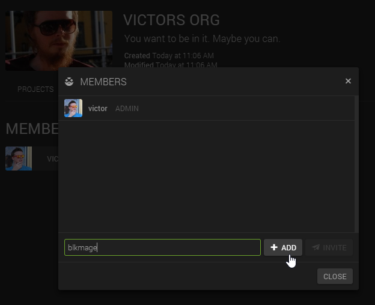
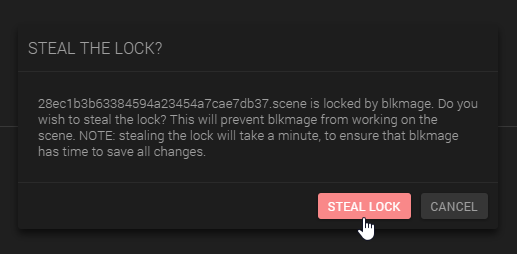
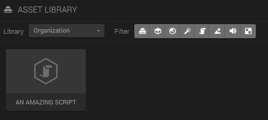
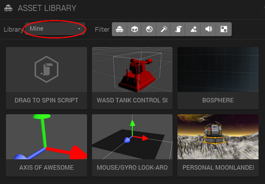

Organizations enable teams to collaborate. Within an Organization, you can manage and share assets with other team members and work on the same projects.

## Creating an Organization

1. Click _Organizations_.
3. Click _Create Organization_.
4. Enter your Organization and payment details.
5. Press _Create_.

You can now reach your new Organization from the Dashboard left menu.

After creating a new organization  

  

Organization details after editing the image and description  

## Adding Organization members

While looking at the Organization details, click the _Members_ tab and select _Manage_. Now simply type a username or email, and click _Add_. The user will be notified via e-mail. Note that the input field will turn green if the username is valid.

  

## Collaboration: Locks

A Lock is a mechanism to prevent weird things to happen if two or more users want to edit the same project at the same time. At this time, you simply can't. Only one user at a time can own a Lock on a Scene. That user will be the only one able to edit. When entering a scene that another using is viewing or editing, you are given the opportunity to _steal_ the Lock. If you do, you'll get the exclusive rights and the other user will get kicked out. Communication is encouraged!

  

Oops! Another team member decided to steal the lock in order to edit the scene.

  

If you try to enter a Scene with a Lock on it, you can choose to steal the lock or exit.

## Organization Assets

Organizations enable sharing of Assets. There are two ways to create a shareable Asset. You can either create the Asset directly from a shared Project, or you can copy personal assets into the Organization.

### Adding a shared asset from Goo Create

When working in a shared Project, adding resources to the Asset Library will automatically share them with the Organization members. Simply click any of the Add to Asset Library buttons, enter details and click Add.

  

Adding an asset to the Organization  

  

After adding the Asset, it shows up in the Asset Library. Note the Organization library selection.  

### Copying a Personal Asset to an organization

If an Asset is in a personal and non-shared, it's easy to copy it to an Organization.

  

A personal Asset  

Go to the **Dashboard**, and select Assets in the left-hand menu. Locate the asset you want to share (_Personal Moonlander_), click the gearbox icon, and select _Copy To_.  

  

Choosing an Asset to copy  

Select the desired Organization. After copying, you should now have two copies of the asset. One personal, and one shared.  

  

One personal and one shared copy of the Asset.  

### Viewing and Managing the Shared Assets

  

The shared assets can be viewed and managed from the Organization view in the Dashboard.