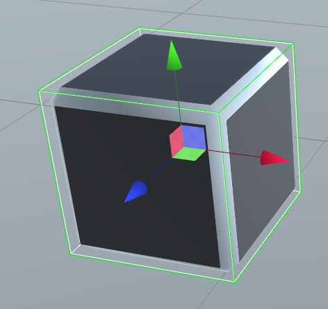

The *Collider Component* adds collision geometry to the entity. If used together with a Rigid Body Component, you can create a dynamic, colliding entity.

The collider shapes are rendered with a green wireframe in Create.

## Without a Rigid Body Component: Static

If the collider doesn't have any Rigid Body Component, it will become a static collision geometry in the physics world.

## With a Rigid Body Component: Dynamic

If the entity with a Collider Component or any of its parents has a Rigid Body Component, it will turn into a dynamic collision geometry in the collision world.

## Shape Types

The currently available shapes are:

* Box
* Sphere
* Plane
* Infinite plane

## Triggers

If the collider is a trigger, then it will *not* collide with other physics objects. However, it will emit events when a physics object enters it. Available events are:

* goo.physics.triggerEnter
* goo.physics.triggerStay
* goo.physics.triggerLeave

## Friction

Friction is a number that can be set on the Collider. Zero means no friction. The final friction (and restitution) value used in a collision is computed using multiplication. For example, a sphere with friction=0.5 that collides with a plane with friction=0.5 will get a friction value of 0.25.

## Restitution (bounciness)

Restitution (a.k.a. bounciness) is a number that can be set on the Collider, and defines how much the collider should bounce. Zero is no bounce and one is maximum bounce. If you set restitution to a number larger than one, it will gain more and more energy for each bounce.

## Collision Events

If the collider is not a Trigger, it will emit these events during collisions:

* goo.physics.beginContact
* goo.physics.duringContact
* goo.physics.endContact