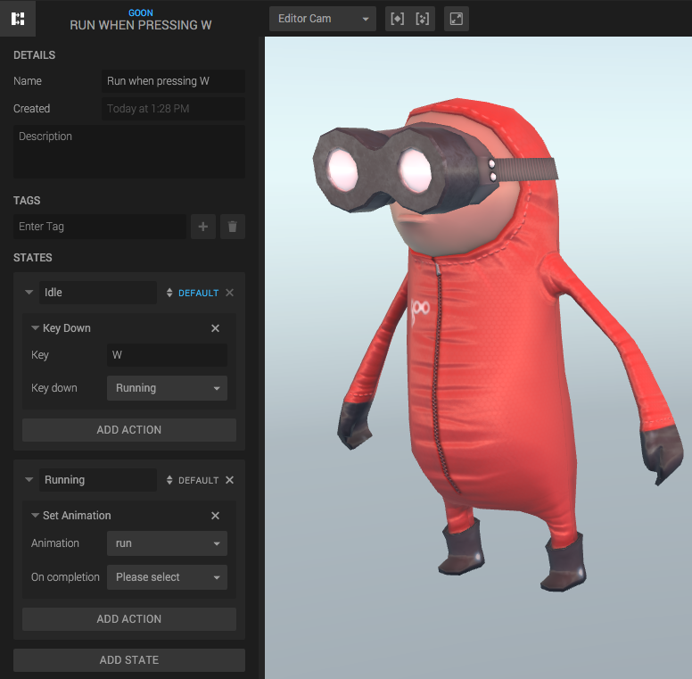
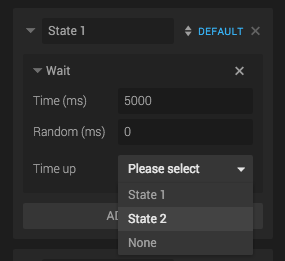

The *State Machine Component* adds simple logic to the entity, similarly to scripts. The difference from scripts is that the State machine is much easier to use (no coding required!) and have many built-in Create-specific Actions.

The State Machine Component has two main panels, the panel for the Component:

...and a panel for the Behavior:

## Structure

The State machine has a list of *Behaviors*, which contains *States*, which in turn contain *Actions*.

[Read more about Finite State Machines on Wikipedia](https://en.wikipedia.org/wiki/Finite-state_machine).

### Behaviors

A *Behavior* is a collection of states. A state machine component can have several behaviors, and they are independent of each other. A Behavior can be seen as and behaves like *an independent state machine*.

### States

Each *Behavior* has one or several *States*, but only one *active* state. As long as a state is active, all its *Actions* will also be active. All actions in inactive states are inactive. The *active state* can be changed by *transitions* in the state’s actions.

A Behavior always has one *Default State* which is activated when you press Play.

### Actions

An *Action* is some logic gets executed while its State is active. Some actions executes its logic once and are done, while others execute logic once per frame. There are also Actions that just listens for events, and executes logic when the event happens.

There are many types of Actions and their effect varies a lot. Some examples are:

* Pick: Listen for a click/touch on the entity.
* FireFX: Emits fire particles from an entity.
* KeyDown: Listen for and react to key presses.
* Collide: Check for and react to collisions between entities.
* Wait: Transition to another state after a certain amount of time.
* Move: Moves an entity.
* Set Animation: Select active animation.
* Emit: Emits an event to the System Bus.
* ...and so on!

## Transitions: How to switch State

Many of the Actions have events, and they can trigger Transitions to other states. The simplest example is probably the WaitAction. When the Action starts executing, it sets a timer for a number of seconds. When the timer is up, it can transition to some other State.

## Actions list

<table class="table">
<tr><td><b>Add light</b> Adds a point light to the entity</td><td></td></tr>
<tr><td><b>Apply force</b> Apply a force to the attached rigid body.</td><td></td></tr>
<tr><td><b>Apply impulse</b> Apply an impulse to the attached rigid body.</td><td></td></tr>
<tr><td><b>ApplyTorque</b> Apply a torque to the attached rigid body.</td><td></td></tr>
<tr><td><b>Arrow Keys</b> Transitions to other states when arrow keys are pressed</td><td></td></tr>
<tr><td><b>Background Color</b> Sets the clear color</td><td></td></tr>
<tr><td><b>Camera Distance</b> Performs a transition based on the distance to the main camera or to a location</td><td></td></tr>
<tr><td><b>Compare 2 Counters</b> Compares the value of 2 counters</td><td></td></tr>
<tr><td><b>Compare Counter</b> Compares a counter with a value</td><td></td></tr>
<tr><td><b>Copy Joint Transform</b> Copies a joint's transform from another entity, and applies it to this entity. This entity must be a child of an entity with an animation component</td><td></td></tr>
<tr><td><b>Dolly Zoom</b> Performs dolly zoom</td><td></td></tr>
<tr><td><b>Emit Message</b> Emits a message (a ping) to a channel on the bus. Messages can be listened to by the Listen action, or by scripts using the SystemBus.addListener(channel, callback) function.</td><td></td></tr>
<tr><td><b>Fire FX</b> Makes the entity emit fire. To "extinguish" the fire use the "Remove Particles" action.</td><td></td></tr>
<tr><td><b>Hide</b> Hides an entity and its children</td><td></td></tr>
<tr><td><b>In Box</b> Performs a transition based on whether an entity is inside a user defined box volume or not.The volume is defined by setting two points which, when connected, form a diagonal through the box volume.</td><td></td></tr>
<tr><td><b>In View</b> Performs a transition based on whether the entity is in a camera's frustum or not</td><td></td></tr>
<tr><td><b>Increment Counter</b> Increments a counter with a value</td><td></td></tr>
<tr><td><b>Key Down</b> Listens for a key press and performs a transition</td><td></td></tr>
<tr><td><b>Key Pressed</b> Listens for a key press event and performs a transition. Works over transition boundaries.</td><td></td></tr>
<tr><td><b>Key Up</b> Listens for a key release and performs a transition</td><td></td></tr>
<tr><td><b>Listen</b> Performs a transition on receiving a system bus message (a ping) on a specific channel</td><td></td></tr>
<tr><td><b>Log Message</b> Prints a message in the debug console of your browser</td><td></td></tr>
<tr><td><b>Look At</b> Reorients an entity so that it's facing a specific point</td><td></td></tr>
<tr><td><b>Mouse Down</b> Listens for a mouse button press and performs a transition</td><td></td></tr>
<tr><td><b>Mouse Move</b> Listens for mouse movement and performs a transition</td><td></td></tr>
<tr><td><b>Mouse Up</b> Listens for a mouse button release and performs a transition</td><td></td></tr>
<tr><td><b>Move</b> Moves the entity</td><td></td></tr>
<tr><td><b>Pause Animation</b> Pauses skeleton animations</td><td></td></tr>
<tr><td><b>Pick</b> Listens for a picking event on the entity and performs a transition</td><td></td></tr>
<tr><td><b>Pick and Exit</b> Listens for a picking event on the entity and opens a new browser window</td><td></td></tr>
<tr><td><b>Random Transition</b> Performs a random transition</td><td></td></tr>
<tr><td><b>Remove Light</b> Removes the light attached to the entity</td><td></td></tr>
<tr><td><b>Remove Particles</b> Removes any particle emitter attached to the entity</td><td></td></tr>
<tr><td><b>Resume Animation</b> Continues playing a skeleton animation</td><td></td></tr>
<tr><td><b>Rotate</b> Rotates the entity with the set angles (in degrees).</td><td></td></tr>
<tr><td><b>Scale</b> Scales the entity</td><td></td></tr>
<tr><td><b>Set Animation</b> Transitions to a selected animation</td><td></td></tr>
<tr><td><b>Set Animation Time Scale</b> Sets the time scale for the current animation</td><td></td></tr>
<tr><td><b>Set Counter</b> Sets a counter to a value</td><td></td></tr>
<tr><td><b>Set Material Color</b> Sets the color of a material</td><td></td></tr>
<tr><td><b>Set Render Target</b> Renders what a camera sees on the current entity's texture</td><td></td></tr>
<tr><td><b>Shake</b> Shakes the entity. Optionally performs a transition.</td><td></td></tr>
<tr><td><b>Show</b> Makes an entity visible</td><td></td></tr>
<tr><td><b>Smoke FX</b> Makes the entity emit smoke. To cancel the smoke emitter use the "Remove Particles" action.</td><td></td></tr>
<tr><td><b>Sound Fade In</b> Fades in a sound. NOTE: will not work on iOS devices.</td><td></td></tr>
<tr><td><b>Sound Fade Out</b> Fades out a sound and stops it.</td><td></td></tr>
<tr><td><b>Switch Camera</b> Switches to a selected camera</td><td></td></tr>
<tr><td><b>Toggle Post FX</b> Enabled/disables post fx globally</td><td></td></tr>
<tr><td><b>Transition</b> Transition to a selected state</td><td></td></tr>
<tr><td><b>TriggerEnter</b> Transitions when a trigger volume is entered.</td><td></td></tr>
<tr><td><b>TriggerLeave</b> Transitions when a collider is leaving the trigger volume.</td><td></td></tr>
<tr><td><b>Tween Light</b> Tweens the color of the light</td><td></td></tr>
<tr><td><b>Tween Look At</b> Transition the entity's rotation to face the set position.</td><td></td></tr>
<tr><td><b>Tween Material Opacity</b> Tweens the opacity of a material</td><td></td></tr>
<tr><td><b>Tween Move</b> Transition to the set location.</td><td></td></tr>
<tr><td><b>Tween Rotate</b> Transition to the set rotation, in angles.</td><td></td></tr>
<tr><td><b>Tween Scale</b> Transition to the set scale.</td><td></td></tr>
<tr><td><b>Tween Texture Offset</b> Smoothly changes the texture offset of the entity</td><td></td></tr>
<tr><td><b>WASD Keys</b> Transitions to other states when the WASD keys are pressed</td><td></td></tr>
<tr><td><b>Wait</b> Performs a transition after a specified amount of time. A random time can be set, this will add between 0 and the set random time to the specified wait time.</td><td></td></tr>
</table>