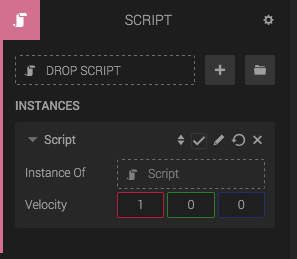
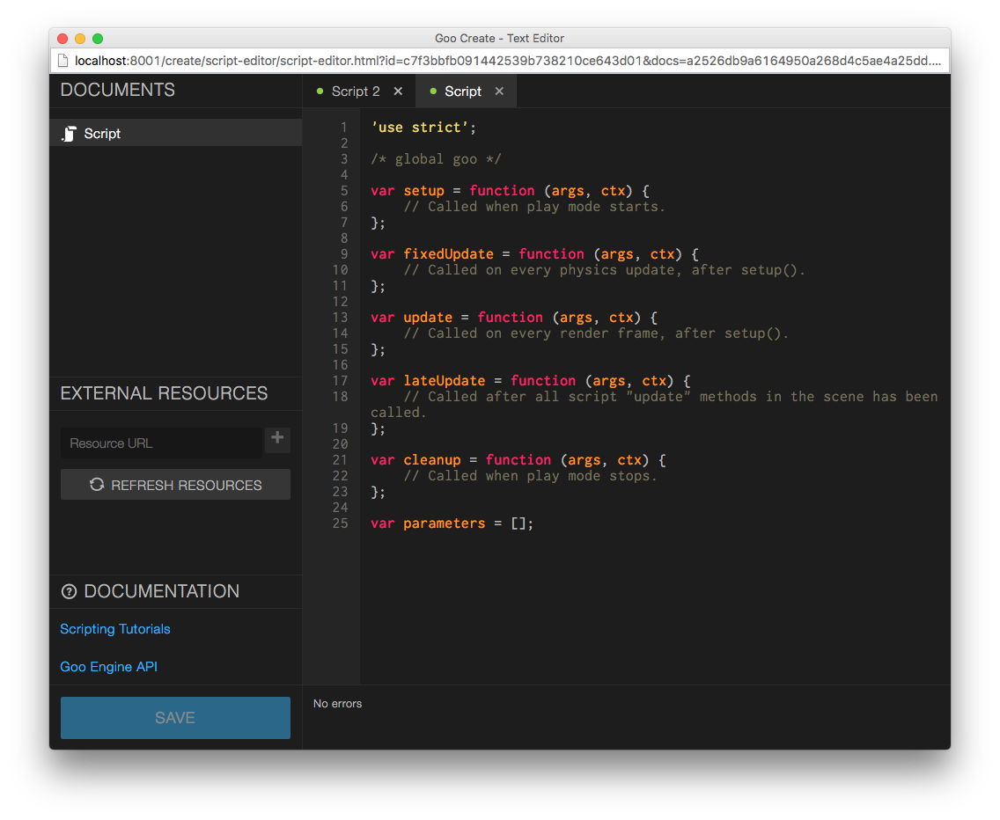

When you create a new script, and open it in the script editor, you get something that looks like this:


'use strict';

/* global goo */

var setup = function (args, ctx) {
    // Will be called when the script is attached to an entity, or when you press Play in Create.
};

var fixedUpdate = function (args, ctx) {
    // Will be called once per physics update.
};

var update = function (args, ctx) {
    // Will be called once per render frame, if the script is set up.
};

var lateUpdate = function (args, ctx) {
    // Will be called after all script "update" methods in the scene has been run.
};

var cleanup = function (args, ctx) {
    // Will be called when the script component is removed from the entity, or when you press *Stop* in Create.
};

// Script parameter definitions, will show in the script panel
var parameters = [];


The script lets you define three functions and some parameters.

## The ctx object

The context is an object, unique per Script, that you can use to store your script data during the script life time. The context is created upon setup() and cleared on cleanup() and is passed into all of the script functions. It has a few pre-defined properties:

<table class="table">
	<tr>
		<th>Property</th>
		<th>Type</th>
		<th>Description</th>
	</tr>
	<tr>
		<td>entity</td>
		<td>
			<a href="http://code.gooengine.com/latest/docs/index.html?c=Entity">Entity</a>
		</td>
		<td>The entity that the script is attached to.</td>
	</tr>
	<tr>
		<td>entityData</td>
		<td>Object</td>
		<td>Data object, shared between all scripts on the Entity.</td>
	</tr>
	<tr>
		<td>activeCameraEntity</td>
		<td>
			<a href="http://code.gooengine.com/latest/docs/index.html?c=Entity">Entity</a>
		</td>
		<td>The currently active camera entity.</td>
	</tr>
	<tr>
		<td>domElement</td>
		<td>HTMLCanvasElement</td>
		<td>The WebGL canvas element.</td>
	</tr>
	<tr>
		<td>playTime</td>
		<td>number</td>
		<td>The elapsed time since scene start.</td>
	</tr>
	<tr>
		<td>viewportHeight</td>
		<td>number</td>
		<td>Height of the canvas.</td>
	</tr>
	<tr>
		<td>viewportWidth</td>
		<td>number</td>
		<td>Width of the canvas.</td>
	</tr>
	<tr>
		<td>world</td>
		<td>
			<a href="http://code.gooengine.com/latest/docs/index.html?c=World">World</a>
		</td>
		<td>The world</td>
	</tr>
	<tr>
		<td>worldData</td>
		<td>Object</td>
		<td>Data object, shared between all scripts in the World.</td>
	</tr>
</table>

### Data objects and scoping

The **ctx** object unique to each script, and properties we define on it will only be accessible by that script. Some of its properties are shared between scripts. *entityData* is shared by all scripts on the entity and *worldData* is shared by all scripts. They are all initially empty, and can be used to store any kind of data

For example, if we'd like to define a property called *acceleration*, we could make it available on three levels:

// Only accessible to the script that defined the property
ctx.acceleration = 9.82;

// Accessible to all scripts on the entity
ctx.entityData.acceleration = 9.82;

// Accessible to all scripts
ctx.worldData.acceleration = 9.82;

## The global goo object

The **goo** object provides access to classes in the [Goo Engine API](http://code.gooengine.com/latest/docs/).

## Parameters and "args"

var setup = function(args, ctx) {
    console.log(args.velocity); // access the passed argument by key
};

var parameters = [{
    name: "Velocity",
    key: "velocity",
    type: "vec3",
    default: [1, 0, 0]
}];

All parameters that are declared in the *parameters* array can be accessed via the **args** during runtime. The parameters are also displayed the *Script component panel* in Create. The above script will generate the following script component panel:

Below you can read more about what the custom parameters lets you do.

### Parameter Format

Parameters need to be defined on a specific format. It is mentioned in the comments of an empty script too, but here's a walkthrough of the structure.

*Required:*

*   **key [string]** - The property key in the **args** object that should be used for this parameter.
*   **type [string]** - Parameter type (see available types further down).
*   **default** - Default value for the parameter.

*Optional:*

*   **name [string]** - The name that shows up in the script component panel.
*   **control [string enum]** - Type of control in the script component panel. Will be discussed later.
*   **description [string]** - Tooltip for the script component panel.
*   **options [array]** - Used with the *select* control type.
*   **min [number]** - Used with *int* or *float* types.
*   **max [number]** - Used with *int* or *float* types.
*   **decimal [number]** - Number of fractional digits for *float* values.
*   **step [number]** - Step (increment) amount for *float* values.
*   **precision [number]** - Number of significant digits for *float* values.
*   **exponential [boolean]** - Used with *slider* control type.

### Parameter Types

The type property must be set to one of a few predefined strings, each corresponding to a type of parameter.

*   **int** - Integer number variable (e.g. *5*).
*   **float** - Number variable (e.g. *3.14*).
*   **string** - String (e.g. *"HelloGoo"*).
*   **boolean** - boolean (*true* or *false*).
*   **vec2** - An array of 2 numbers.
*   **vec3** - An array of 3 numbers.
*   **vec4** - An array of 4 numbers.
*   **texture, sound, entity, camera, animation, json** - Direct references to different types of objects, controlled by drag-and-drop areas in the script panel.

All types in action, including a sample script:

var parameters = [
    { type: 'int', key: 'int', 'default': 1, description: 'Integer input' },
    { type: 'float', key: 'float', 'default': 0.1, description: 'Float input' },
    { type: 'string', key: 'string', 'default': 'Hello!', description: 'String input' },
    { type: 'boolean', key: 'boolean', 'default': true, description: 'Checkbox' },
    { type: 'vec2', key: 'vec2', 'default': [0, 0], description: 'Vector2 input' },
    { type: 'vec3', key: 'vec3', 'default': [0, 0, 0], description: 'Vector3 input' },
    { type: 'vec4', key: 'vec4', 'default': [0, 0, 0, 0], description: 'Vector4 input' },
    { type: 'texture', key: 'texture', description: 'Texture asset drop area' },
    { type: 'sound', key: 'sound', description: 'Sound asset drop area' },
    { type: 'entity', key: 'entity', description: 'Entity drop area' },
    { type: 'camera', key: 'camera', description: 'Camera drop down' },
    { type: 'animation', key: 'animation', description: 'Animation state from the Animation component on the same entity' },
    { type: 'json', key: 'json', description: 'JSON asset drop area' },
    { type: 'float', control: 'slider', key: 'floatSlider', 'default': 10.1, min: 5, max: 15, exponential: false, decimal: 1, description: 'Float slider input' },
    { type: 'int', control: 'slider', key: 'intSlider', 'default': 10, min: 5, max: 15, exponential: false, description: 'Integer slider input' },
    { type: 'vec3', control: 'color', key: 'vec3Color', 'default': [1, 0, 0], description: 'RGB color input' },
    { type: 'vec4', control: 'color', key: 'vec4Color', 'default': [1, 0, 0, 1], description: 'RGBA color input' },
    { type: 'string', control: 'select', key: 'select', 'default': 'a', options: ['a', 'b', 'c'], description: 'Dropdown/select' },
    { type: 'int', control: 'jointSelector', key: 'jointSelector, description: 'Joint select from the animation component on a parent entity' }
];

## External dependencies

You can add external JavaScript dependencies to your script. To do this, enter a URL in the left panel of the script editor, and click the *+* button.

Note that the URLs you enter should start with *//* and not *http://* or *https://*.

The JavaScript dependencies will be loaded and executed immediately inside the Create editor (click "Refresh resources" to re-download and execute). In your published scene, all dependencies will be loaded and executed during the loading phase.
