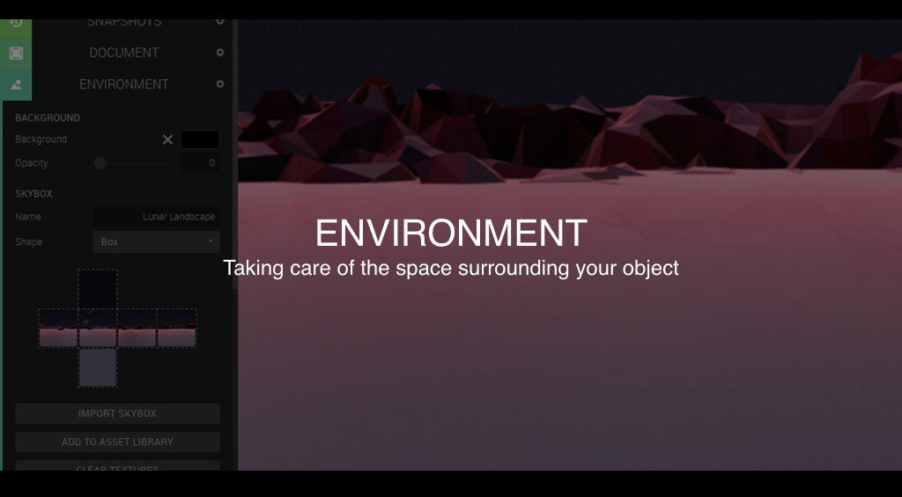

The ENVIRONMENT tab is an essential part of Create. For those of you coming from an art background, this tab would roughly constitute the negative space of your scene. Everything surrounding your 3D objects is defined here, and it can also have a lot of influence of how your objects are shown. We'll start by opening the ENVIRONMENT tab.

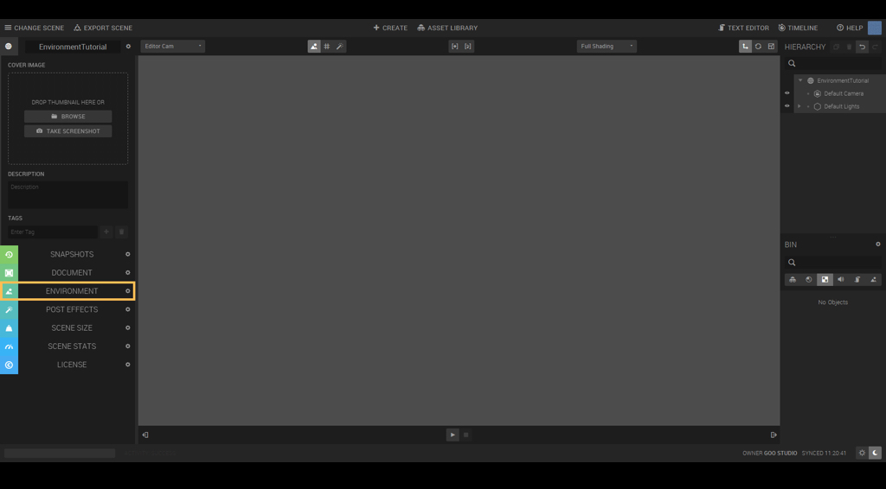

Let's take it from the top. The BACKGROUND part lets you set the color of the background in your scene, of which the default is a neutral grey. This works for most things, but it can also be a bit boring. Lets change it!

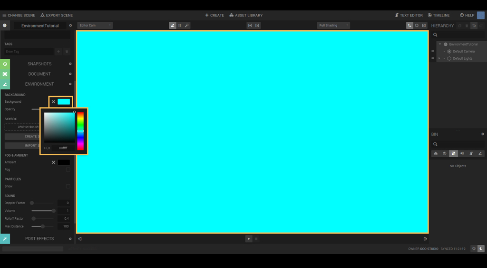

The color field works very much like the color fields in the material editor. Simply click the box to open the color picker, and chose your new background color! Displayed here is a favourite of mine; cyan. Very Sci-Fi!

The opacity slider found just below the background only influences published projects, where your project is used as an overlay over an existing site. To do this, the Color must be set to full black (#000000) and the Opacity slider be turned all the way down to 0. Make sure to have the Transparent Background checked when publishing your scene!

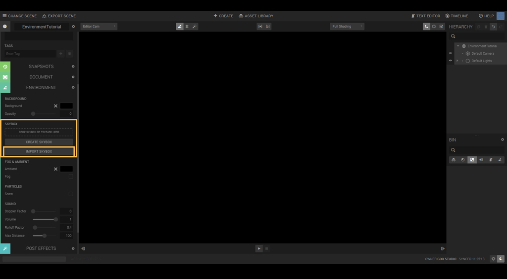

The SKYBOX is where things get a bit more interesting. The Color only lets you chose a single color as the background, but the skybox can be anything you want! In simple terms, a skybox can be described as a (virtually) infinitely large box, that you only see the inside of. On this box, you can project a texture of your choice! Let's learn by doing; click on CREATE SKYBOX and turn the page.

You can now see six squares. Each side corresponds to a side of the skybox in the viewport. At this point you can
either import your own images, or use the ready made skyboxes from our own ASSET LIBRARY. For the sake of
simplicity, this is where we'll start. Click the IMPORT SKYBOX button to get access to our ready made skyboxes, and
then choose and add LUNAR LANDSCAPE.

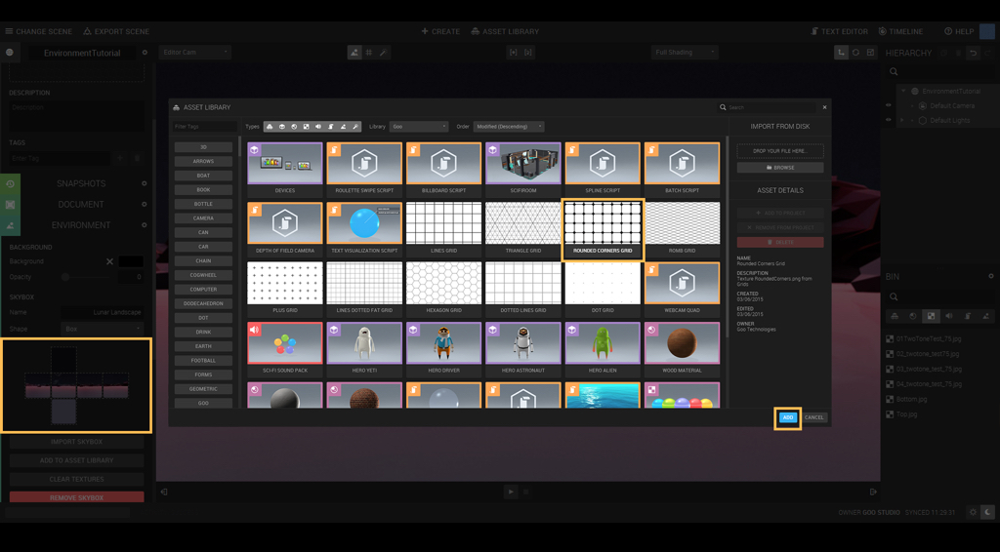

Great! You can see in the ENVIRONMENT tab how each image slot is filled, and together they make up the
background in the viewport. This is of course not limited to only landscape images. Lets try a pattern instead! Go
ahead and open up the ASSET LIBRARY, and import any of the GRID assets. I'm a big fan of ROUNDED CORNERS, so
that is what I'll use. 

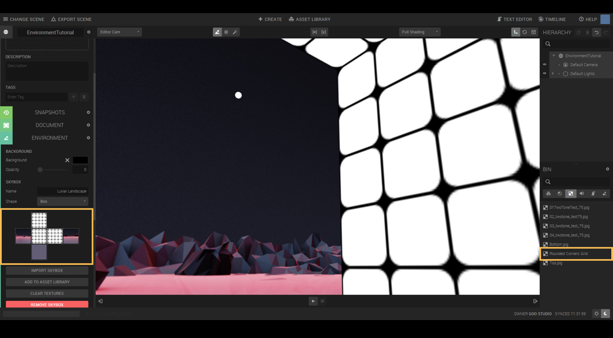

In your BIN (located in the segment right below your HIERARCHY view) you should now have a texture called
"Rounded Corners Grid". You can drag and drop this into each of the slots in the skybox area. Note how the
environment is changing as you drop the new texture!
Remember that the textures you are using have to tile without seams.

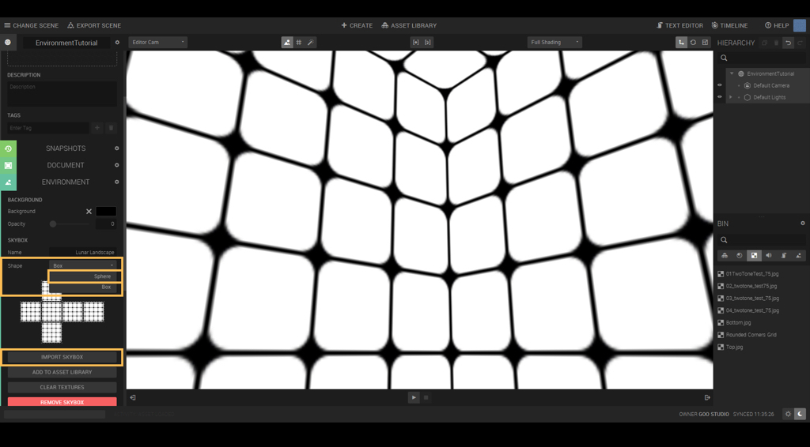

The attentive follower of this tutorial will have noticed that there is a drop down menu within the skybox as well,
"Shape". Right now it is set to Box, but there is another option: Sphere. This works in a fairly similar way, with the
obvious difference being that this is a sphere instead of a box. Textures will have to be adjusted to account for this.
Set the shape to sphere, and press the "IMPORT SKYBOX" button again.

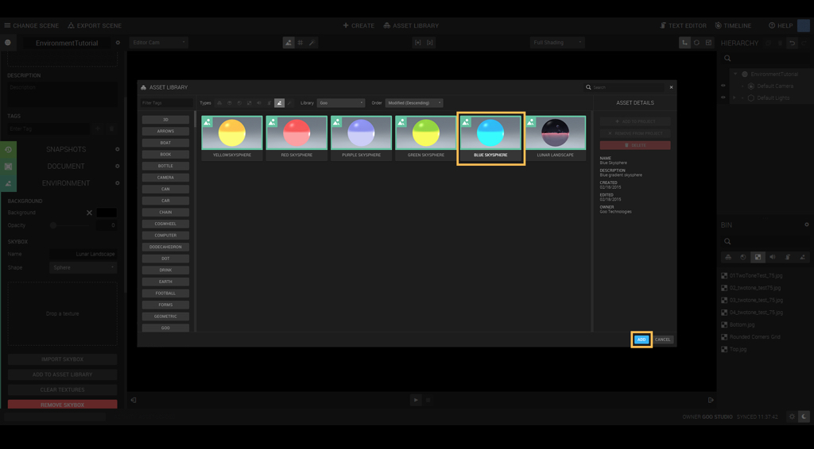

The texture for the skysphere is wrapped around the length of the sphere. This means that for a gradient like ours,
the texture width can be as low as one pixel wide, something that might help you keep the file size down.

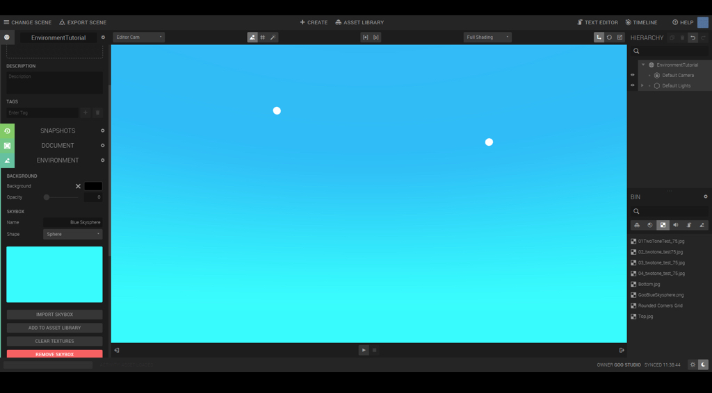

You can also use our fantastic SPHERICAL REFLECTION MAP script form the ASSET LIBRARY to generate a custom
skysphere based on your scene, but that is another tutorial in itself. Let's keep our focus on the ENVIRONMENT tab
for now.

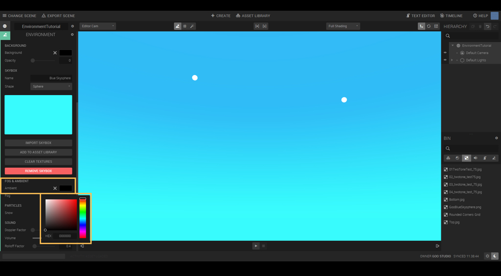

Assuming you have acquainted yourself with our materials, you should be fairly familiar with their Ambient setting.
This is essentially the same thing, but on a global scale. Changing its color will affect the ambient level for all objects
in the scene. Note that it will not have any effect on the skybox/skysphere.

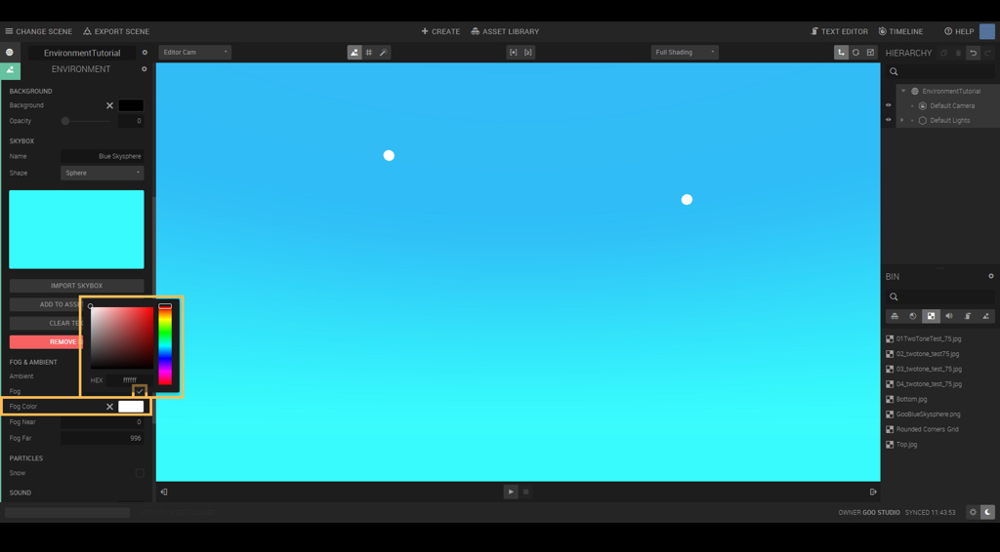

Fog is a nice way to help set the mood and atmosphere of a scene. Check the box for it and you can set the color and
range of the fog. 

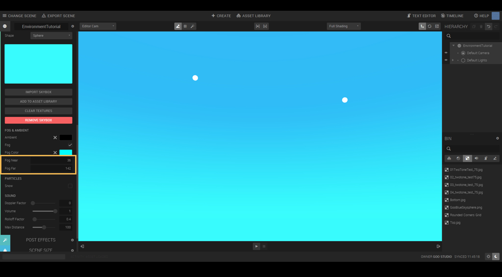

Fog Near and Fog Far influence (quite self explanatory) where the fog should start and end. In other words: Fog Near
controls the distance from the camera until the fog starts, and Fog Far decides the distance until the fog is full. This
is easiest to control in a scene with all your things in place. As a rule, Fog Near should never have a higher value than
Fog Far. A good tip is to try and match the fog color with the sky color as best as you can! Fog does not influence the
skybox.

It's best to play around a bit with the fog for yourself, to get a feel of its scale and impact. You'll need some objects in
the scene to see the effect, so try and add some and move them around! You'll get the hang of how fog works in no
time.

Great job! Publish that scene, and don’t forget to take a preview picture! Where you go from here is up to you, but we
have more tutorials in our Learn section, if you still feel the need to learn the ropes a bit.