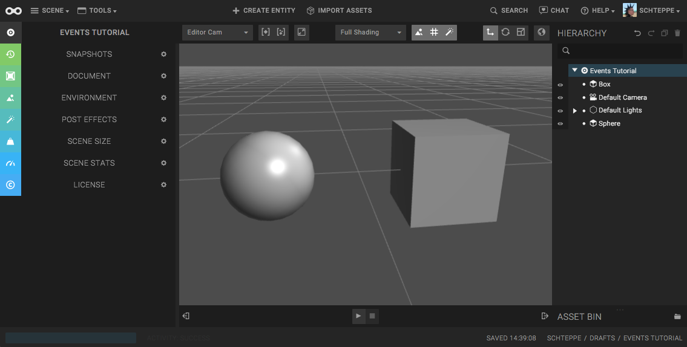

*Events* is a way to communicate across state machines, timelines and scripts. It's useful when building interactive apps. This tutorial will walk you through how to use events in Goo Create.

The tutorial assumes that you are somewhat familiar with the State Machine, so you might want to have a look at the [State Machine tutorial]({{ '/tutorials/create/state-machine' | prepend: site.baseurl }}) first.

In this tutorial we will make a Box entity rotate when we click a Sphere.


## Before we start: What is an event?

A basic event consists of a *name*. This name is used to indicate that something happened. For example, if you make a button entity, you can make it emit a ```"buttonClicked"``` event when it's clicked. Other entities can listen to this event and react to it as they want.

An event can also carry more information about the event, such as *which* or *how* button was clicked. But for most applications, the event name is good enough.

In our tutorial we will use a ```"sphereClicked"``` event, to indicate when the sphere is clicked.


## Set up the scene

1. Go to [goocreate.com](http://goocreate.com) and log in to Goo Create.
2. From the Dashboard, create a new Empty scene.
3. Open the Create dialog by clicking *Create* at the top.
4. Choose "Sphere".
5. Create a Box by repeating steps 3 and 4, but instead choosing "Box".
6. Position the box and sphere so they don't overlap. Use either the Transform panel or mouse drag the gizmos in the viewport.

When you're done, your scene will look something like this:




## Emitting an event from the Sphere

You can use the State machine to emit an event. Add the "Emit Message" action to a state and it will emit the message when the State is entered.

To emit an event in a Script, you would use [goo.SystemBus.emit](http://code.gooengine.com/latest/docs/index.html?c=Bus). This is not needed in our tutorial, but it's good to know.

We want the Sphere to emit a ```"sphereClicked"``` event when it is clicked, so we do the following:

1. Add a *State Machine Component* to the sphere.
2. Add a *Behavior* to the State Machine. Name it "Emit on click".
3. Open the Behavior, and rename the initial state to "Listen for pick".
4. Add a *Pick action* to the initial state.
5. Create a second state, name it "Emit Event".
6. Add an *Emit action* to the second state, and set the channel name to "sphereClicked".
7. Connect the "to" transition of the Pick action to the second state.

The result should look like this:


## Listening for an event in the Box

Any script or state in the State Machine can listen to events, and do whatever they want to react to it.

To listen to an event using the State Machine, simply use the *Listen* action. Make sure to specify the event name correctly: ```"sphereClicked"```.

The Listen action has a "to" transition, which you can use to transition when the event happens. We will create a new State, and connect it here. In the new State, we want the box to rotate, so we add a *Rotate action*.


To listen to events in Scripts, you would use the [goo.SystemBus.addListener](http://code.gooengine.com/latest/docs/index.html?c=Bus) method. We won't do this in this tutorial, but now you know.

## Done!

You can now press Play and try to click the sphere. When clicked, it will emit the ```"sphereClicked"``` event. The Box will react to the event, and start rotating.

Next step is to do more complex event systems. Or emit events from the Timeline and/or Scripts. Good luck!