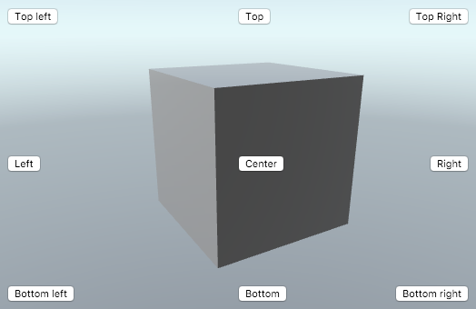
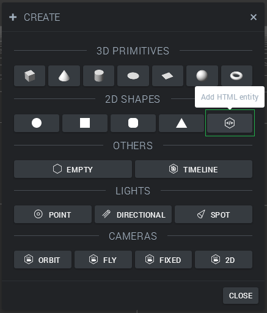
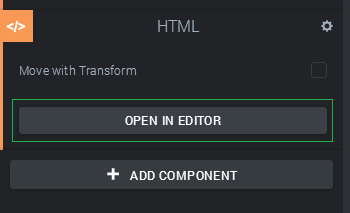

First, we will create a new HTML Entity. We do this by clicking *Create Entity* in the top bar. Next, we choose the *HTML Entity* inside the list.



An HTML Entity is inserted into the scene. By default, the HTML Entity will be placed in 3D space and update its transform according to its entity position. For our case, we just want to position things relative to the screen, so we uncheck the 'Move with Transform' checkbox.

In order to have our buttons align with the sides of the screen, inside the HTML Entity code, we'll need to set the CSS style and positioning for each button. We do this by clicking the button 'Open in Editor':



Once the editor is open clear out the existing code and replace it with the following:


<style type="text/css">
  /* Turn off pointer events for the parent and #myContainer */
  .goo-entity {
    pointer-events: none
  }
  /* Set default pointer events for everything inside myContainer */
  #myContainer * {
    pointer-events: auto
  }
  /* myContainer should cover the whole screen */
  #myContainer {
    width: 100vw;
    height: 100vh;
  }
  .alignTop {
    position: absolute;
    top: 10px;
    left: 50%;
    width: 80px;
    margin-left: -40px;
  }
  .alignRight {
    position: absolute;
    right: 10px;
    top: 50%;
    height: 20px;
    margin-top: -10px;
  }
  .alignBottom {
    position: absolute;
    left: 50%;
    bottom: 10px;
    width: 80px;
    margin-left: -40px;
  }
  .alignLeft {
    position: absolute;
    left: 10px;
    top: 50%;
    height: 20px;
    margin-top: -10px;
  }
  .alignBottomRight {
    position: absolute;
    right: 10px;
    bottom: 10px;
  }
  .alignBottomLeft {
    position: absolute;
    left: 10px;
    bottom: 10px;
  }
  .alignTopLeft {
    position: absolute;
    left: 10px;
    top: 10px;
  }
  .alignTopRight {
    position: absolute;
    right: 10px;
    top: 10px;
  }
  .alignCenter {
    position: absolute;
    top: 50%;
    left: 50%;
    height: 20px;
    width:80px;
    margin-top: -10px;
    margin-left: -40px;
  }
</style>
<div id="myContainer">
  <button class='alignTop'>Top</button>
  <button class='alignRight'>Right</button>
  <button class='alignBottom'>Bottom</button>
  <button class='alignLeft'>Left</button>
  <button class='alignBottomRight'>Bottom right</button>
  <button class='alignBottomLeft'>Bottom left</button>
  <button class='alignTopLeft'>Top left</button>
  <button class='alignTopRight'>Top Right</button>
  <button class='alignCenter'>Center</button>
</div>


<<<<<<< HEAD
Also note, we use the ctx.domElement.parentNode instead of the document.body, in case the project is being published on an iFrame or other situation. That is it!  Now when you run the project, the buttons should appear along the sides of the screen, like they appear in the screen shot.
=======
This will give us nine buttons with different alignment. Note that to center horizontally, we used ```width``` and a ```margin-left``` set to half of the width but negative. Play around with the buttons and classes and find one that fits your needs!
>>>>>>> d7c04cad306437ca0ae27488f3be44f3ff7e98f2
