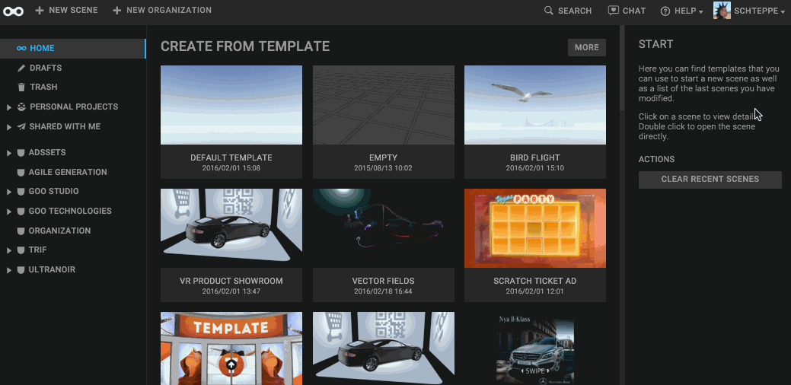
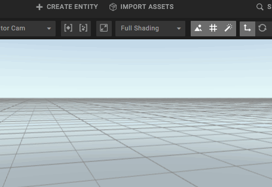
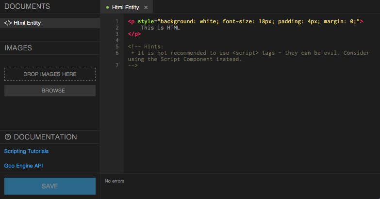
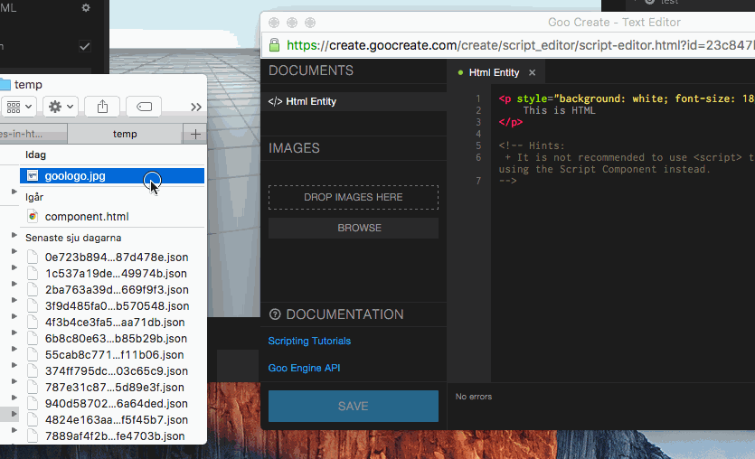
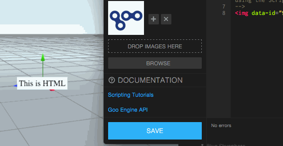

This tutorial will show you how to add an image to your HTML component.

Prerequisities: You should have basic knowledge about HTML.


*The end result: a 2D HTML image floating around in 3D space*


## Step 1: Create a new scene

From the Dashboard, create a new scene by clicking one of the default templates. Name your scene and click *Create*.




## Step 2: Add an HTML component

Click the *Create Entity* button in the top bar and choose *HTML Component*.




## Step 3: Open the HTML editor

In the HTML Component panel to the left, click the *Open in Editor* button.


The script editor will open and it will look like this:




## Step 4: Drag an image file to the Images bin

Drag and drop your image from your computer to the *Images* bin in the left panel of the script editor.



Note that an `````` tag appears in your HTML automatically.


## Step 5: Save

Click the blue *Save* button in the script editor to see the changes in the scene.




## Done!

You now have an image in your HTML component!


