Hello and welcome to the "Basic Physics in Goo Create" tutorial.  

The tutorial will be split into two parts:

 * The first part will create a tilted box and a few cylinders and a ball to roll along the box and collide with the cylinders.  
 * The next part will take this basic scene and enhance it to become a simple pinball game.  

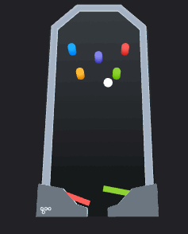

<a class="btn btn-primary btn-lg" href="https://goote.ch/05779f4996204f14aabff73ee0333afe.scene">Launch finished game</a>

<a class="btn btn-default btn-lg" href="https://app.goocreate.com/edit/05779f4996204f14aabff73ee0333afe.scene">Open scene in Create</a>

Please note that this tutorial is written in a way so you can attempt to follow it without prior knowledge of Goo Create, but I do recommend to read some of the starter tutorials first.

## Introduction

The first component we will use is the rigid body component the second is the collider component.

The rigid body component is mainly responsible to track the position, the rotation and the linear and angular velocity of a physical object.  

The collider component, as the name implies, is responsible to calculate and detect collisions between physical objects. But it serves a double purpose: with a click on a checkbox it can act as a trigger instead, allowing other physical objects to pass through and notify user code so it can take some respective action. (For example this can be used for a jump pad.)  

Together they make it possible to create physical behaviors.

**Here is a handy list of rules how to configure your physical components:**  

**1\. I want to create a static (not moving, fixed) physical object**  

Use a basic shape (box, sphere, cylinder, quad) and add a collider component and select the correct shape in the collider settings. Optionally you can add a rigid body component and set the mass to zero. But his is not needed.  

**2\. I want to create a dynamic physical object that is affected by gravity and collides with other physical objects**  

Use a basic shape and add a collider and a rigid body component. Select the correct shape in the collider settings and set the mass setting in the rigid body component to something that matches the kilos of the object you are creating.  

**3\. I want to create a physical object of which I want to control the linear and angular velocities using Goo Create script**  

Use a basic shape and add a collider and a rigid body component. Select the correct shape in the collider settings and set the **kinematic** setting in the rigid body component. Then read the next part of this tutorial to see how you can set the velocities.  

OK, enough theory, let's get started with a real project!  

## Part 1: Using the new rigid body and collider components in a basic scene.

In this part we will create a box, a few cylinders, a ball and give them all physical behaviors and then tilt them all to get some easy action going.  

Please log into Goo Create and create a new scene.  

Click on the +CREATE button at the top and select the empty entity and name it "Table". This will become the parent to all visible shapes and this will be the entity we will tilt in the end.  

Please note: There is currently a bug where the  table entity also needs a rigid body component with the mass set to zero. This should not be necessary and it will be fixed in the near future.  

Click on +CREATE again to add a box shape to the scene. Rename the box entity to "Floor" and with the box still selected open up the TRANSFORM panel to the left in Goo Create. Change the scaling to be 20, 1, 40.  

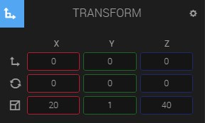

Next we add a collider component. Under the transform settings please click on the +ADD COMPONENT button and select COLLIDER:

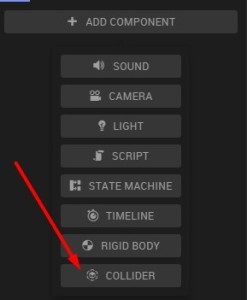

Please change the restitution and the friction to zero:  

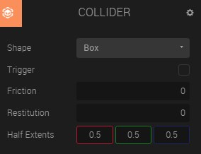

Friction is the resistance that one surface or object encounters when moving over another. Restitution in the context of physics is best described as "bouncyness".  

We set both to zero since we don't want the ball to bounce on the pinball flipper floor nor do we want it to slow down.  

Ok, now we are ready to create the walls. Create another box and change the name to LeftWall. Then give it the following transform values:  

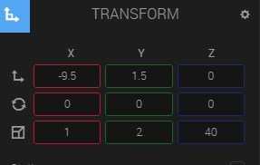

Also add a collider component and set the friction to zero and the restitution to 0.5 so the ball bounces of the wall.  

Repeat these steps for the right wall, the only difference is the X position: Instead of -9.5 please set it to 9.5.  

Finally we add the TopWall. Add another box and give it these transform settings:  

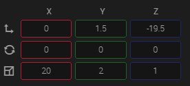

Give it the same collider settings as the other walls.  

Your scene should now look like this:  

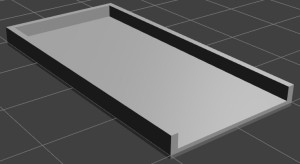

Ok, let's test our scene. For this we will nest the floor and walls under the empty Table entity we added at the start of this tutorial.  

Then we will tilt the pinball table 36 degrees and add a ball.  

To nest an entity under another entity you simply drag and drop the entity (child) onto the other (parent). Repeat this for the floor and all the walls. Then click on the Table entity and rename it to "Table". Finally go to the transform settings and change the X rotation to be 36\. This should have resulted in your table to be tilted like  this:  

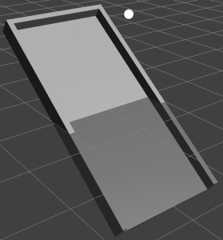

Finally let's add the ball. Click on +CREATE and select the sphere shape. Rename it to "Ball", set the transform settings to 0, 8.5, -8.5 and change the scale to 1.5, 1.5, 1.5.  

For the ball to behave properly we need to give it two components: A collider and a rigid body component. First let's add the already familiar collider.  

Change the "Shape" setting to "Sphere". Set the friction to zero and the restitution to 0.5\. Next add the RIGID BODY component and set the mass to 2.5\. You can imagine the mass to represent weight in kilos.  

Well, let's press play (at the bottom) and see what happens. :-)  

If everything works as expected you should see the ball dropping onto and rolling along and finally falling off of the floor.  

Ok, let's make it a bit interesting, let's add some bumpers!  

First reset the tilt of the Table to zero degrees. We reset the tilt because Goo Create has a feature where nesting entities recalculates the local transform settings to not move the nested entity relative the the new parent.  

This is a very powerful feature but in our case we don't want it. Instead we want to reset the Table, then place the bumpers on top of it, nest them and then set the tilt again so to make the bumpers move and rotate together with the table.  

So reset the tilt of the Table entity by setting the X rotation to zero. Then create one cylinder using the +CREATE button and select the cylinder shape.  

Rename the "Cylinder" to "Bumper1" and then go to the transform setting and set the following:  

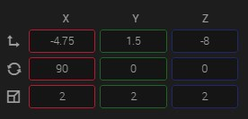

( Note: of course you can place your bumpers where ever you like. Just make sure to keep the 1.5 for the Y translation and the 90 for the X rotation. )  

You should now have your first bumper and it should look something like this:  

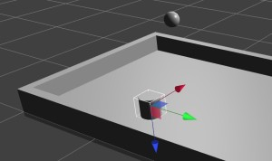

Next we add a collider component to the bumper. Set the friction to zero and the restitution to 2, this will make the bumpers very bouncy, just like we want them to behave. Fell free to play around with even higher values.  

Finally for this bumper we will nest it under the Table entity. To do this select the Bumper1 entity and drag it onto the Table entity. Now when we tilt the table again, the bumper will move with it as if it was glued to the table.  

Now we will use a nice trick to make our life a bit easier. We will duplicate the bumper and just move the duplicates. The benefit of this is, that we don't need to add a collider to each new Cylinder and we don't need to set the common transform for each.  

Select the Bumper1 entity and press Ctrl-D or Command-D -to create the duplicate. The new Bumper is now selected and we can change the transform settings to move it to it's final position. Please only change the X translation setting to 4.75.  

Press Ctrl-D or Command-D again and the X translation setting to zero.  

You should now have tthree bumpers evenly distributed, but they are kinda hard to see. Let's set some colors to make it easier. I will give my floor a light blue color and the rest will be a light red.  

Keep in mind that clicking on a nested entity will select the parent entity. So to change the right material settings make sure to select the entity in to top right hierarchy panel.  

Select one after another: the floor, the walls, the ball and the bumpers and give them any color you like. I recommend light pastel colors because they are easy on the eyes.  

Another nice trick is to change the Material for one of the walls, for example the LeftWall and then drag and drop it onto all the other entities except for the floor. That makes sure that all vertical entities have the same appearance. But that might or might not be the look you are aiming for. Feel free to any approach you like.  

And another trick to fake a metal ball is to import any Skybox from the Asset Library and then set the Reflectivity like this:  

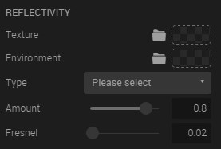

Let's duplicate one of the bumpers two more times. Set the translation to -2.375, 1.5, -4 and to 2.375, 1.5, -4 respectively.  

After tilting the table again, my scene now looks like this:  

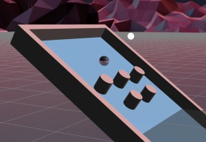

Pressing play reveals a problem of course: The bumper and the ball are perfectly aligned, so the the ball never stops bouncing on it. The fix is simple, we just move the ball a bit to the side. Let's try -1.88 for the X translation.  

Try it out by pressing play, the ball should bounce around a bit and then fall of the table.  

If this is happening for you too **Congratulations!** **You successfully completed Part 1 of this tutorial series!**