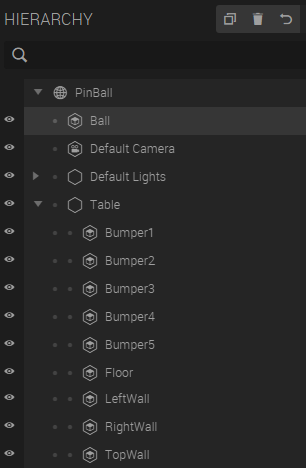
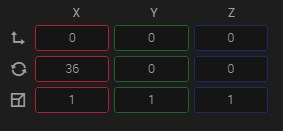
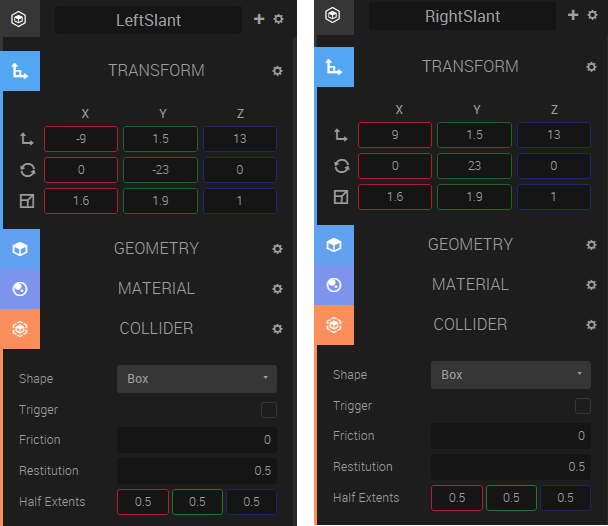
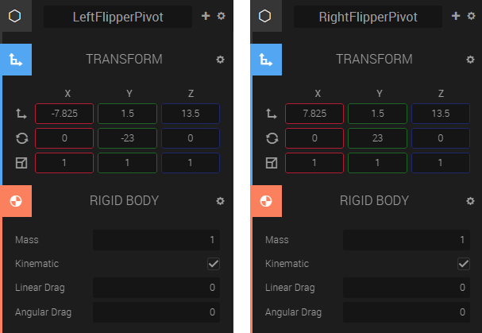
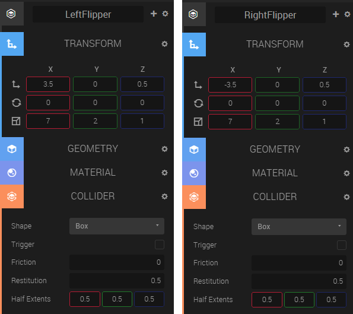
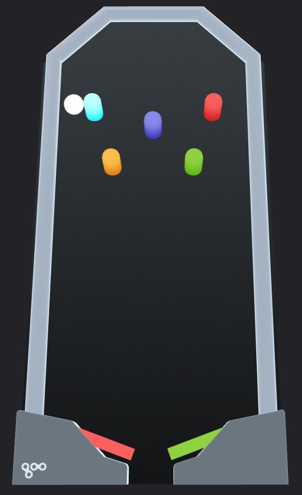

In [part 1]({{ "/tutorials/create/physics-part-1" | prepend: site.baseurl }}) of the "Basic Physics in Goo Create" tutorial we created a tilted pinball table, some bumpers and a ball. Pressing play showed that the ball moved around the pinball table in a physically realistic way.

Here is a screen shot of the entity hierarchy you should have so far if you followed the first part.

In this part we will add the bottom flippers and slants and finally the script to give them the appropriate behavior.

Remember: before we can add new entities to the table we have to reset the table tilt. The table tilt is set to 36 degrees on the X axis:

Hint: To see this you have to click on the table in the entity hierarchy (on the right side) and open up the transform panel (on the left side).

Change the rotation degrees to zero and the table should appear flat again.

Now we add the slants. The slants are at the side of the flippers and keep the ball from [draining](https://en.wikipedia.org/wiki/Glossary_of_pinball_terms#D).

Hint: If you want the game to be harder you can leave the slants out of course.

To add the slants simply add another two boxes and give them a collider component and the following settings:

It should look like this:

OK, now it's time to add the actual flippers. Since a flipper needs to flip from the side we need to give them a parent entity or they would spin instead of flip.

So let's first add two empty entities. Give them each a rigid body component and the following settings:

Finally we add the flippers themselves. Add another two boxes. Give them fitting names like LeftFlipper and RightFlipper. Then nest them each under it's appropriate pivot entity. Then give them colliders and the following settings:

Here is a screen shot of the final entity hierarchy:

OK, we are done with the entity hierarchy. It is time to tilt the pinball table again. Select the table entity and change the X rotation to 36 again.

Hint: If you want you can move the slants around to fit the flippers better.

Here is my final result:

Now we will add the script.

Make sure you have selected the table entity. Now click on +ADD COMPONENT and select script. Inside the script component panel select ADD SCRIPT and select CUSTOM.

Click on the edit button

and replace the existing script with this one:

var setup = function(args, ctx, goo) {
    ctx.speed = 8;

    ctx.cw = new goo.Vector3(0, ctx.speed, 0);  // clockwise rotation
    ctx.ccw = new goo.Vector3(0, -ctx.speed, 0); // counterclockwise rotation
    ctx.tempVec = new goo.Vector3(0,0,0);
    ctx.tempQuat = new goo.Quaternion();

    ctx.roundit = function(v) { return Math.round(v * 100) / 100; };

    function initFlipper(name, dir, vec) {
        var f = ctx.world.by.name(name).first();
        f.on = false;
        f.lr = f.transformComponent.transform.rotation; // local rotation shortcut
        f.wr = f.transformComponent.worldTransform.rotation; // world rotation shortcut
        f.lr.toAngles(ctx.tempVec);
        f.start = ctx.roundit(ctx.tempVec.y);  // flipper start rotation
        f.goal = ctx.roundit(ctx.tempVec.y + dir);  // flipper end rotation
        f.wr.applyPost(vec); // tilt the cw or ccw rotation vector along the table slope
        return f;
    }

    ctx.leftFlipper = initFlipper('LeftFlipperPivot', Math.PI * 0.25, ctx.cw);
    ctx.rightFlipper = initFlipper('RightFlipperPivot', -Math.PI * 0.25, ctx.ccw);

    ctx.ball = ctx.world.by.name('Ball').first();

    function react(e, flag, dirLeft, dirRight) {
        switch(e.keyCode){
            case goo.ScriptUtils._keys.Leftarrow:
            case goo.ScriptUtils._keys.A:
                if(flag === ctx.leftFlipper.on){
                    ctx.leftFlipper.on = !flag;
                    ctx.leftFlipper.rigidBodyComponent.setAngularVelocity(dirLeft);
                }
                break;
            case goo.ScriptUtils._keys.Rightarrow:
            case goo.ScriptUtils._keys.D:
                if(flag === ctx.rightFlipper.on){
                    ctx.rightFlipper.on = !flag;
                    ctx.rightFlipper.rigidBodyComponent.setAngularVelocity(dirRight);
                }
                break;
        }
    }

    ctx.keydown = function(e) {
        react( e,false,ctx.cw,ctx.ccw);
    };
    ctx.keyup = function(e) {
        react( e,true,ctx.ccw,ctx.cw);
    };
    document.body.addEventListener('keydown', ctx.keydown, false);
    document.body.addEventListener('keyup', ctx.keyup, false);
    document.body.addEventListener('touchstart', ctx.keydown, false);
    document.body.addEventListener('touchend', ctx.keyup, false);

    ctx.checkTarget = function(flipper, target, speed, comparator) {
        var tc = flipper.transformComponent;
        flipper.lr.toAngles(ctx.tempVec);
        var rot = ctx.roundit(ctx.tempVec.y);
        if(rot !== flipper.goal){
            var angle = ctx.tempVec.y + speed * ctx.world.tpf;
            if( (comparator === '>=' && angle >= target) || (comparator === '<=' && angle <= target)){
                flipper.rigidBodyComponent.setAngularVelocity(goo.Vector3.ZERO);
                flipper.lr.fromAngles(0, target, 0);
                tc.updateTransform();
                tc.updateWorldTransform();
                ctx.tempQuat.fromRotationMatrix(tc.worldTransform.rotation);
                flipper.rigidBodyComponent.setQuaternion(ctx.tempQuat);
            }
        }
    }
};

var cleanup = function(args, ctx, goo) {
    document.body.removeEventListener('keydown', ctx.keydown);
    document.body.removeEventListener('keyup', ctx.keyup);
    document.body.removeEventListener('touchstart', ctx.keydown);
    document.body.removeEventListener('touchend', ctx.keyup);
};

var update = function(args, ctx, goo) {
    if(ctx.leftFlipper.on){
        ctx.checkTarget( ctx.leftFlipper, ctx.leftFlipper.goal, ctx.speed, '>=');
    } else {
        ctx.checkTarget( ctx.leftFlipper, ctx.leftFlipper.start, -ctx.speed, '<=');
    }

    if(ctx.rightFlipper.on){
        ctx.checkTarget( ctx.rightFlipper, ctx.rightFlipper.goal, -ctx.speed, '<=');
    } else {
        ctx.checkTarget( ctx.rightFlipper, ctx.rightFlipper.start, ctx.speed, '>=');
    }
};

Click on play and you should have a working Goo Pinball Game! PS: If you spend more time on details and involve a graphics artist you get this:

<a class="btn btn-primary btn-lg" target="_blank" href="https://c1.goote.ch/05779f4996204f14aabff73ee0333afe.scene">Launch finished game</a>
