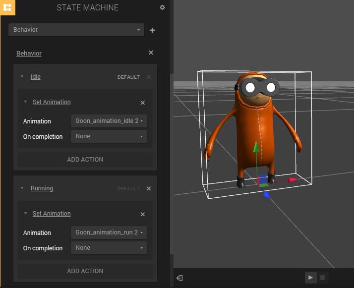
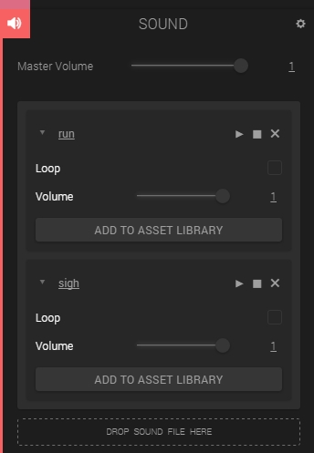
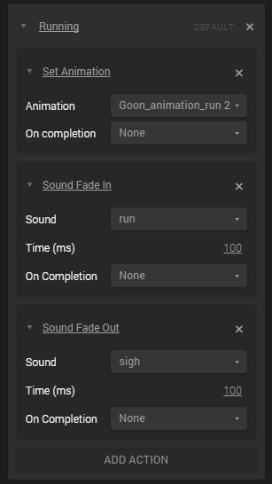
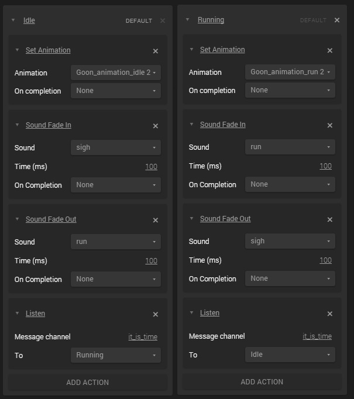

The SystemBus, a global instance of the [Bus class](http://code.gooengine.com/latest/docs/index.html?c=Bus), provides a way to communicate across scripts, state machines, and timelines. It's an event-driven mechanism which can be really useful when building interactive apps. This tutorial will provide some basic examples of its use.

## Emitting a Message

The most basic message consists of only a **channel name**, represented by a string. This string is typically used to indicate that something happened, and does not imply any particular effect of the event. It's just a way for something to say "_this just happened, and whoever is listening may react however they wan_t"! This way of thinking aligns with the [DOM Event Mode](https://developer.mozilla.org/en/docs/Web/API/Event)l, where for example events such as _mouseup_, _keydown_, _mousemove_, etc are emitted when a user interacts with the browser , and it's up to the listeners do decide what to to with the information. Here's a simple example, emitting a message (roughly) every second:


var setup = function(args, ctx, goo) {
	ctx.interval = 1;
	ctx.lastUpdate = ctx.world.time;
}

var update = function(args, ctx, goo) {
	var delta = ctx.world.time - ctx.lastUpdate;
	if (delta > ctx.interval) {
		goo.SystemBus.emit('it_is_time');
		ctx.lastUpdate = ctx.world.time;
	}
};


## Listening to a Channel

Any script or state in the State Machine can listen to a channel, and do whatever it wants with the information. Using the "it_is_time" channel from the example above, we can for example rotate an entity every time it happens. Note that this script can be placed on a different entity than the first one, **everything in the same scene uses the same bus!**


var setup = function(args, ctx, goo) {
	ctx.rotate = function() {
		ctx.entity.addRotation(0, 0.1, 0);
	};
	goo.SystemBus.addListener('it_is_time', ctx.rotate);
};

var cleanup = function(args, ctx, goo) {
	goo.SystemBus.removeListener('it_is_time', ctx.rotate);
};


Note that we **must remove the listeners we create**, otherwise we'd get duplicates every time we press play!

## Sending Data in Events

In addition to the channel name, we can send an Object with the emitted events. If we for example were sending messages every time entities in our scene collides, we could send the names of the colliding entities and the point of collision with the event. Expanding on the previous example, we can add some more code to let our time ticker send some extra data, and have the listening entity react to some of this data:


var setup = function(args, ctx, goo) {
	ctx.interval = 1;
	ctx.lastUpdate = ctx.world.time;
}

var update = function(args, ctx, goo) {
	var delta = ctx.world.time - ctx.lastUpdate;
	if (delta > ctx.interval) {
		var data = {
			delta: delta,
			parity: (Math.floor(ctx.world.time) % 2 === 0) ? "even" : "odd",
		};
		goo.SystemBus.emit('it_is_time', data);
		ctx.lastUpdate = ctx.world.time;
	}
};


The listening entity:


var setup = function(args, ctx, goo) {
	ctx.rotate = function(data) {
		if (data.parity === 'even') {
			ctx.entity.addRotation(0, 0.1, 0);
		} else if (data.parity === 'odd') {
			ctx.entity.addRotation(0.1, 0, 0);
		}
	};
	goo.SystemBus.addListener('it_is_time', ctx.rotate);
};

var cleanup = function(args, ctx, goo) {
	goo.SystemBus.removeListener('it_is_time', ctx.rotate);
};


The above additions sends some data about the event (whether the world time seconds are even or odd, and what the actual delta is), and the listening entity recieves this data and decides how to act on it.

## Using the Bus to Trigger State Machine Transitions

In Create, pretty much anything can be done with scripts. However, sometimes the State Machine provides an easier and cleaner way of doing certain things. For example, setting animations or playing sounds takes a few lines of code but is really easy to do in the State Machine. With the power of the System Bus, we can set up transitions in the State Machine and trigger them with scrips. Here's how.

### The Goon Machine

We'll start by importing our omnipresent Goon from the Asset Library, and add a State Machine component to the entity. We'll use one single behavior with two states, Idle and Running. We'll also add some <em>set animation</em> actions on the states. Need some refreshment on your State Machine skills? Check out <a title="The State Machine" href="{{ '/tutorials/state-machine' | prepend: site.baseurl }}" target="_blank">the State Machine tutorial</a> before moving on! The Goon states will look like this:
  
  

A good start! But let's also seize the moment and learn how to work with simple **sounds**! Let's add a sound component to the Goon and import two mp3 files, [sigh.mp3](sigh.mp3) and [run.mp3](run.mp3).

  

Now we'll use the State Machine to turn these on and off. Each state will have a _Sound Fade In_ action and a _Sound Fade Out_ action. The actions in the Idle state will fade **out** the run sound and fade **in** the sigh sound. The Run state will of course do the opposite. I've set all time parameters to 100 to fade in/out a little quicker than the standard 1000 ms.  

The running state fades in the corresponding sound and fades out the other one.  

Now we need to set up the transitions, and this is where the System Bus comes into play again. For both the states, we'll add a Listen action. This action will listen to the correct channel and perform a transition to another state. Note that both states will listen to the same channel!  

The complete states, side by side  

We can use the same event triggering mechanism as before, but I suggest changing the interval to be more than a second:


var setup = function(args, ctx, goo) {
	ctx.interval = 6;
	ctx.lastUpdate = ctx.world.time;
}

var update = function(args, ctx, goo) {
	var delta = ctx.world.time - ctx.lastUpdate;
	if (delta > ctx.interval) {
		var data = {
			delta: delta,
			parity: (Math.floor(ctx.world.time) % 2 === 0) ? "even" : "odd",
		};
		goo.SystemBus.emit('it_is_time', data);
		ctx.lastUpdate = ctx.world.time;
	}
};


Note here that our State Machine does not use the data, only the channel name. We can still keep the data around in case other entities are interested! We should now be able to play our scene and have the Goon both switch animations and play different sounds. Here's a link to the published version - I've added some extra light effects using another state machine bus listener.

### [Open the Scene](https://goote.ch/c27b938433b34bbc8e99c5ce8c9460c1.scene/)

Click to open! Don't forget to turn up the volume :)

## Wrap-Up

This was a quick intro of what can be done with the System Bus. It has a lot of use cases. One can use it to react to colissions, trigger timed events (like above), react to user input, et cetera et cetera. It's a very useful weapon to have in the Goo arsenal, and hopefully it can make your apps faster, cleaner and simpler!