
Create has been updated many times since the original writing of this tutorial. While the concepts still are similar, there might be slight differences in certain interface and feature details. At this time template projects no longer exist, but you can still create the scene yourself.

## The Goal

As in any good cooking show, we have prepared the final result beforehand. The **template project** _Creating a Goon_ is already ready to use, accessible from the project list. The project features a Goon with super special, light emitting glasses. After pressing **play**, the Goon can be controlled with the W, A and D buttons.

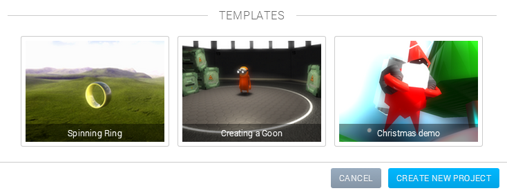

Template projects - for the practically minded For those of you interested in how to arrive at this beautiful creation, please join us in this tutorial!

## Getting Things into the Scene

The first step is, unsurprisingly, to open up an empty Create project (if you can’t find the **create new project** button, it is at the very bottom of the **project list**). Goo Create comes with a useful **asset library**. Luckily for us, this library happens to contain everything we need for this project! The Import From Asset Library button is found by clicking the **import **button in the top left corner of the screen.

The asset library is reached from the import menu We are going to need two of the **entities** to begin with. The two entities we’ll initially need are _Goon_ and _Goo Lab_. We simply click the asset library asset and the they will be added to our canvas. We will also scroll down a bit in the asset library and add the _Goo Lab_ **skybox**. If we close the asset library now and zoom out a bit, this is what we see:

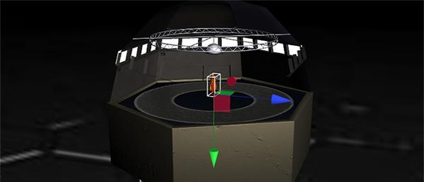

Super mega secret Goon lab of Doom Zooming, by the way, is done with either the middle mouse wheel or by scrolling on a trackpad. You can also pan the camera by pressing down the middle mouse button or SHIFT and then moving the mouse. Orbiting the camera is done by pressing down the right mouse button or ALT and moving the mouse. The **grid** overlay can be helpful. If it's not, it can easily be deactivated from the top menu:

If we zoom in a little bit, we notice that the Goon is currently floating in thin air. To not make him feel sick, let’s put his small feet on the ground! Moving a 3D object around is referred to as _translating_, and there is a tool for doing exactly that. It can be reached from the top menu bar.

Translate - make things move Having the translate tool selected, we grab a hold of the Goon and gently move him around until we are happy with the new position.

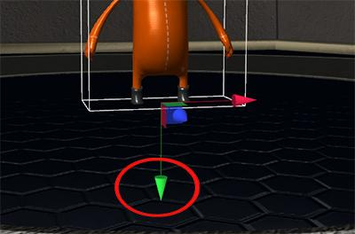

Come back down, Goon. You can't fly.

## Getting in Control

Now we have the Goon in place in his lab, and it is time to give him some exercise. One of the **components** that we can attach to entities is a _state machine component_ which lets us put interactivity into our creations, and acts as an alternative to scripting. Let’s make our Goon run! This will require a **behavior** with two **states**, _running_ and _idle_. The simple, basic idea is that the Goon will go from the idle state to the running state when pressing down W, and will go back to the idle state when the button is released. The two states will be responsible for setting the correct animations (the animations are included with the Goon asset). To give the Goon entity state machine functionality, we'll need to add a state machine component. Start by selecting the Goon, then click the add component button (the big plus) and select _state machine_.

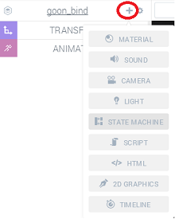

Adding a component If we open the newly created state machine panel, we see that the component already comes with a behavior. We will use this behavior for making the Goon run, so let's rename it to _Running behavior_ (surprise, surprise). Like we concluded earlier, our running behavior will contain two states; one for moving and one for standing still. Our next task will therefore be to add another state and then rename both states to names that make sense. Don’t worry about the contents of the states right now, that will be next! Add another state and rename the states to _Idle_ and _Run_. This is what the behavior should look like at this point:

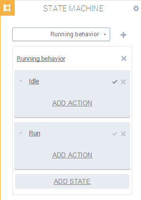

 The states of the Running behavior What entities will do while they are in certain states is decided by the state’s **actions**. Actions can be used for many different things, and we will use it to trigger **transitions** between states, to set animations and to move entities. This is the final structure of the Running behavior (we will go through parts of the process soon):

*   Idle state
    *   Set animation to the idle animation.
    *   If W is pressed, move to running.
*   Run state
    *   Set animation to the running animation.
    *   Move the entity forward along its own Z axis.
    *   If W is released, move to idle.

Pretty simple, right? Each of the bullet points above is represented by an action. Let’s start with adding the actions for the idle state. The actions are added by clicking the **add action** button on a state, and then selecting one of the states from the list. Let's try this by adding a **Set Animatio**n action. When the action has been added, we click to choose an animation from the drop-down menu. Let’s choose *Goon_animation_idle* to have the Goon relax when he’s not running.

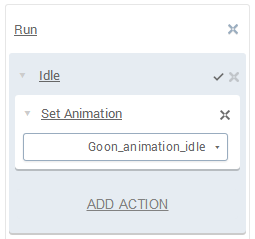

Setting an animation The next action we need to add is the _Key Down_ action. This action, like many others, has a **transition**. Opening the drop-down within the action lets us choose what state to move to when the action is done. When we press a key in the idle state, we want to go to the running state, so choose that in the menu. Also, let **W** be the button which fires the state change.

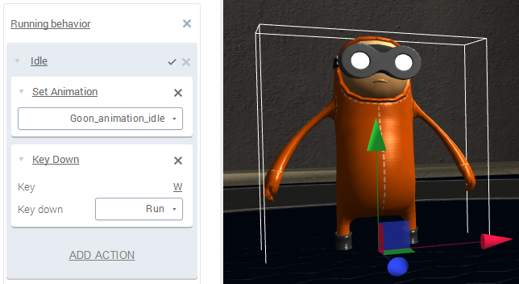

Setting up a state transition Our _Idle _state now has the two necessary states, so let's move on to the _Run_ state. We'll add another **Set Animation** action, this time choosing to start the animation **Goon_animation_running**. We also need to add a **Key Up** action so that the Goon will stop running when **W** is released. Additionally, to not keep the Goon running on the spot, we need a **Move** action. After careful calculations, we have decided that moving 0.2 units in the **Z** direction is optimal.

The complete Running behavior In the picture of the complete _Running_ behavior above, note the check box next to the _Idle_ state. It indicates that the state is the default, and will be active when we start the interaction. If something looks terribly wrong in the states, please back up a bit. Remember that the whole project is available as a template, so a little innocent cheating is easy! This is all we need to make the Goon run. Try it out by pressing the **play** button at the bottom and go crazy on the W button!

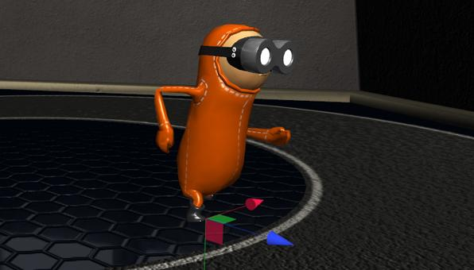

Run Goon, run! We need to add another behavior to make the Goon turn. The reason that we need another behavior, instead of just more states, is that we would like the turning and the running to becompletely _independent_ of each other. Using separate behaviors achieve this. The _Turn_ behavior should contain the following states:

*   Idle state:
    *   Two Key Down actions, one for A and one for D
*   Left state:
    *   Key Up action for A
    *   Rotate action, 130 degrees around the Y axis
*   Right state:
    *   Key Up action for D
    *   Rotate action, -130 degrees around the Y axis

After connecting the transitions to the correct states, the complete Turning behavior should look like this:

The complete Turning behavior Again, please refer to the template project if something is terribly off. If it’s not, the Goon should now be capable of both running and turning!

## Lighting it Up

When creating a new project, a few default lights are added for us (otherwise we wouldn’t be able to see anything). While they might be nice, we now feel artistically confident enough to add our own instead. Let’s start with turning on that big lamp in the ceiling! Lights are, as other entities, added from the **create** panel in the top menu. Opening the panel gives us a few different lights to try out, and what could be better than adding a _spotlight_?

[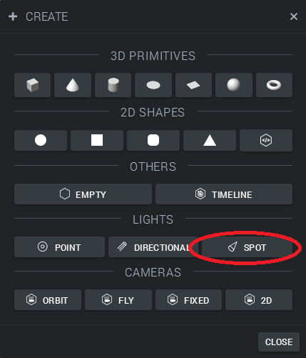](spotlight.png)

Adding a spotlight Add the light, use the translate to move it to the ceiling and then rotate it to point straight down. At this point, we can also select the _default lights_ in the right hand menu and delete them.

[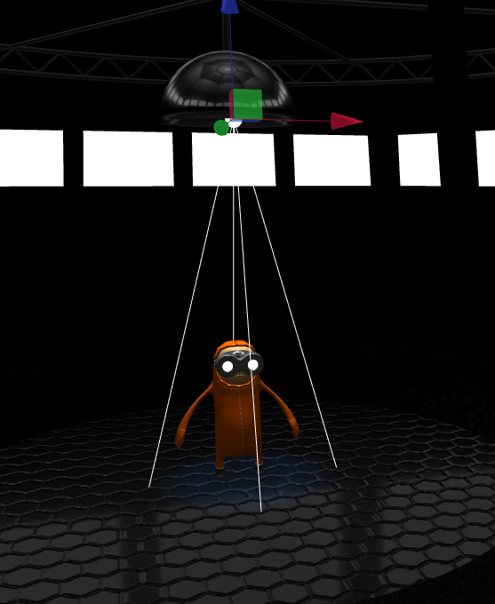](spotlight_translate.png)

An illuminated Goon This looks like a very narrow light, so let us explore and tweak the light settings for a moment. Having the light selected, open the Light panel and try out the settings. Below are the ones used in the template, or at least close to them. Note that the shadow setting is turned on!

[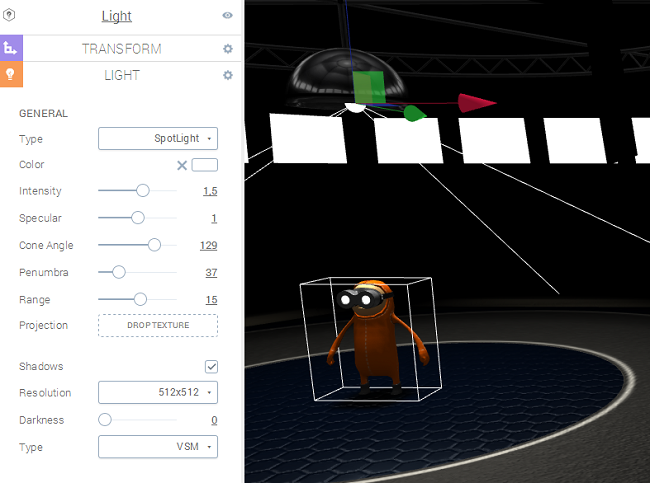](spotlight_settings.png)

Ceiling spotlight settings No Goon is complete without _shining goggles_. To equip or Goon with this absolutely vital detail, we will make use of another **spotlight**, attached to the Goon, and the neat **projection texture** feature. We create another spotlight and then use the hierarchy tree to the right. Expand the Goon entity until the mesh _goon_mesh_ is visible, and then drag and drop the new spotlight to the mesh.

[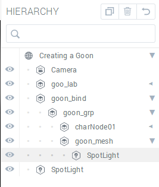](hierarchy.png)

The right hand hierarchy view This makes the light a **child** of the mesh, so that when the mesh is rotated or moved around, the light will follow. This means we can now move the light to the goggles and point it away from the Goon, and it will follow when the Goon moves around. Try it!

[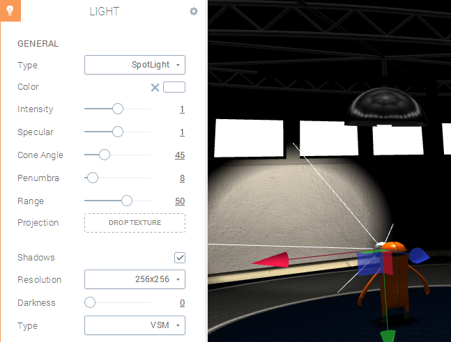](glasses_settings_1.png)

Goo Glasses and the light settings We will now need a texture for the light’s projection.

[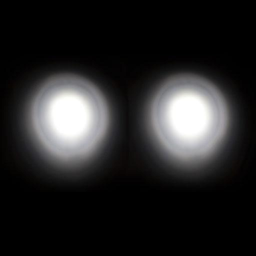](glasses_texture.jpg)

The light projection texture Download the image above, then drag and drop it from your desktop onto the **projection texture slot** in the light panel. The texture will now act as a mask and make the light projection match the goggles.

Pretty neat, huh?

## Final touches

We are pretty close to the look we were aiming for, but let’s not get ahead of ourselves. Opening up the **asset library** again, we can add the _Crate_ asset and put it somewhere nice. Goo Engine is pretty smart about sharing resources, so it’s possible to add more crates and have them share mesh information, textures and so on. If we select the crate and press the **duplicate** button in the top right, we suddenly have twice the amount of crates we had before!

[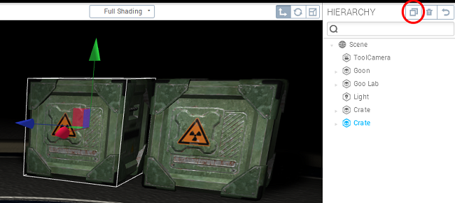](duplicate.png)

Create Crate Cloning Coolness After duplicating the crates until our duplicating urges are satisfied, we have all the assets we need. All that is left is to add some nice **post effects**! Post effects are added from the **scene** panel, accessed by clicking the very top icon in the right hand hierarchy menu. _Bloom_ is an effect that makes light "bleed" from bright areas, and can give a scene a very nice and glowing look. Adding some bloom is very easy, we just click the Add effect button, select _Bloom_, set some parameters and watch the result. Note that the post effects rendering needs to be turned on (the magic wand icon in the top menu)!

It glows! Score! For those of you that stuck with us until this point, thank you. We have used Goo Create to set up a small but very interactive scene using the asset library and the state machine, and then made it look cool using lights and a post effect. Please try out adding more interactivity, more elements, additional post effects and generally do things differently. When you’re done, share the result by going to the **export** panel and **publish** the scene to a website with just one click!

## Stuff to Try

Not enough? Here are some ideas for taking the project further.

*   Add an antialiasing post effect to get rid of any jagged edges that might have appeared.
*   Implement collision with the crates using the state machine or scripting.
*   Add sound effects to the animation.