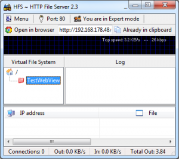

When developing a Goo Engine application it is very handy to have a local web server so that the test cycles are very short. With a local web server you can edit a script or HTML file and reload the browser and immediately see your change.  

I will list some common ways to make this happen for the most common operating systems.  

## HFS (Windows)

My favorite free web server on Windows is [HFS](http://www.rejetto.com/hfs/).  

  

You basically drag and drop a project folder on the HFS window and it will get served.  

To make using HFS more streamlined I have set some options:  

*   Always serve index.html
*   Always quit without saving or confirmations
*   Always use real folders (instead of the virtual folder option from HFS)

The benefit of HFS: You can serve and work with multiple projects at the same time.  

## Mongoose (Windows)

Alternatively you can use the free edition mongoose:  

[http://cesanta.com/mongoose.shtml](http://cesanta.com/mongoose.shtml)  

This one is really simple, just execute the program and it will serve the files in the current directory and below.  

  

You will get a little Systray icon where you can stop it or edit settings.  

## NodeJS

If you already have NodeJS installed locally this is a good choice:  

[https://www.npmjs.org/package/http-server](https://www.npmjs.org/package/http-server)  

Summary:


npm install http-server  
node bin/http-server  


Now you can visit [http://localhost:8080](http://localhost:8080) to view your server.  

## Python

If you already have Python installed locally this is a good choice:  


python -m SimpleHTTPServer # python 2.x  
python -m http.server # python 3.x


And of course you can always use a full blown production grade web server like [Apache](http://httpd.apache.org) or [nginx](http://nginx.org).